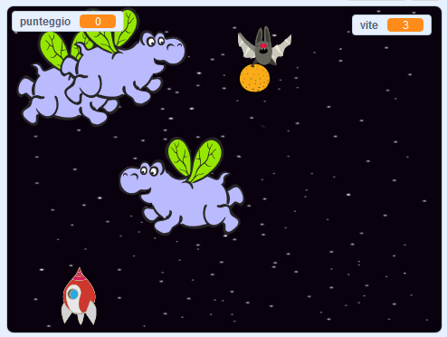

\--- no-print \---

Questa è la versione **Scratch 3** del progetto. C'è anche una [versione Scratch 2 del progetto](https://projects.raspberrypi.org/en/projects/clone-wars-scratch2).

\--- /no-print \---

## Introduzione

In questo progetto imparerai come creare un gioco in cui il giocatore deve salvare la Terra dai mostri spaziali.

### Che cosa creerai

\--- no-print \---

Per iniziare clicca sulla bandierina verde nel gioco di esempio qui sotto, poi premi i tasti freccia <kbd>sinistra</kbd> e <kbd>destra</kbd> per spostare la navicella, e il tasto <kbd>spazio</kbd> per sparare.

  <iframe allowtransparency="true" width="485" height="402" src="https://scratch.mit.edu/projects/embed/276887163/?autostart=false" frameborder="0" scrolling="no"></iframe>
  

\--- /no-print \---

Fai quanti più punti possibile sparando agli ippopotami spaziali volanti. Perderai una vita se vieni colpito da un ippopotamo o da una delle arance fatte cadere dai pipistrelli.

\--- print-only \---

\--- /print-only \---

\--- collapse \---

* * *

## title: Di cosa avrai bisogno

### Hardware

+ Un computer in grado di eseguire Scratch 3

### Software

+ Scratch 3 ([online](https://rpf.io/scratchon){:target="_blank"} o [offline](https://rpf.io/scratchoff){:target="_blank"}"})

### Download

[Trova i download qui ](http://rpf.io/p/en/clone-wars-go).

\--- / chiudi \---

\--- collapse \---

* * *

## title: Cosa imparerai

+ Come far muovere gli sprite usando l'input da tastiera
+ Come clonare gli sprite per farne delle copie
+ Come usare 'broadcast' e 'ricevi blocchi' per inviare messaggi

\--- / chiudi \---

\--- collapse \---

* * *

## title: Note addizionali per gli educatori

\--- no-print \---

Se intendete stampare questo progetto, cliccate su [Versione stampabile](https://projects.raspberrypi.org/en/projects/clone-wars/print){:target = "_ blank"}.

\--- /no-print \---

[ Se hai bisogno della soluzione per questo progetto, puoi trovarlo qui ](http://rpf.io/p/en/clone-wars-get).

\--- / chiudi \---