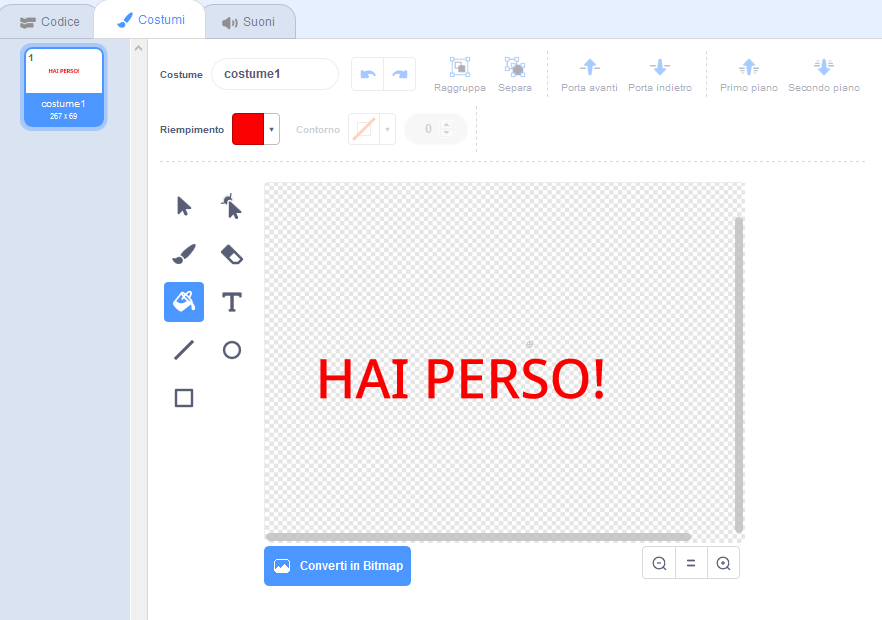
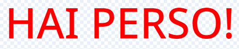

## Fine gioco

Successivamente, aggiungerai un messaggio di 'gioco finito' alla fine del gioco.

\--- task \---

Se non lo hai già fatto, crea una nuova variabile chiamata `vite`{:class="block3variables"}.

La tua astronave dovrebbe iniziare con tre vite e perdere una vita ogni volta che tocca un ippopotamo o un'arancia. Il tuo gioco dovrebbe finire quando le `vite` {: class = "block3variables"} si esauriscono.

\--- /task \---

\--- task \---

Disegna un nuovo sprite chiamato `Gioco Finito` utilizzando lo strumento **text**.



\--- /task \---

\--- task \---

Sullo schermo, fai apparire un broadcast con `gioco finito`{:class="block3events"} subito prima che il gioco finisca.


```blocks3
broadcast (game over v) and wait
```

\--- /task \---

\--- task \---

Aggiungi questo codice al tuo sprite `Gioco Finito` così che faccia apparire alla fine del gioco:



```blocks3
when flag clicked
hide

when I receive [game over v]
show
```

Visto che hai usato un blocco `broadcast (gioco finito) and wait`{:class="block3events"} nel tuo stage, lo stage aspetterà lo sprite `Gioco Finito` per essere mostrato prima della fine del gioco.

\--- /task \---

\--- task \---

Prova il tuo gioco. Quanti puinti puoi fare? Se il gioco è troppo facile o troppo difficile, puoi trovare qualche modo per migliorarlo?

\--- /task \---