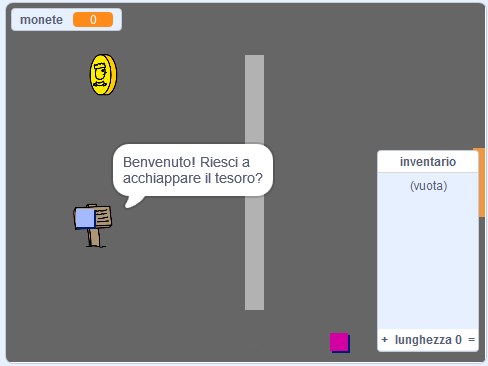

## E poi?

Dai un'occhiata al nostro progetto [Crea il tuo mondo](https://projects.raspberrypi.org/en/projects/create-your-own-world?utm_source=pathway&utm_medium=whatnext&utm_campaign=projects), dove potrai creare il tuo personale gioco d'avventura!

\--- no-print \---

Clicca sulla bandiera verde per cominciare. Usa i tasti freccia per muovere il tuo personaggio in giro per il mondo.

  <iframe allowtransparency="true" width="485" height="402" src="https://scratch.mit.edu/projects/embed/258757783/?autostart=false" frameborder="0" scrolling="no"></iframe>
  

\--- /no-print \---

\--- print-only \---

Usa i tasti freccia per muovere il tuo personaggio in giro per il mondo. 

\--- /print-only \---