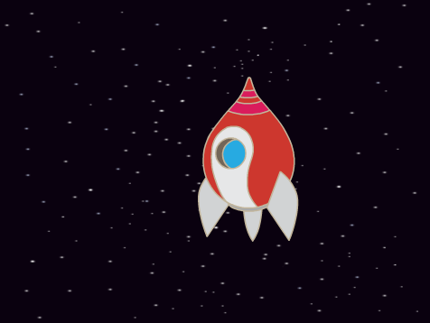

## Creare una navicella spaziale

Creiamo una navicella spaziale che difenderà la Terra!

+ Inizia un nuovo progetto Scratch, e cancella lo sprite del gatto.

[[[generic-scratch-new-project]]]

+ Aggiungi lo sfondo `stelle` e lo sprite `Navicella` al tuo progetto.
    
    

[[[generic-scratch-backdrop-from-library]]]

[[[generic-scratch-sprite-from-library]]]

+ Usa lo strumento **shrink** (restringi) per rendere un po' più piccolo il tuo sprite `Navicella`, e posizionalo vicino alla parte bassa dello schermo.

+ Quando viene premuto il tasto freccia **sinistra**, la navicella spaziale dovrebbe muoversi verso sinistra. Aggiungi questo pezzo di codice per fare in modo che la tua navicella spaziale si muova verso sinistra quando viene premuto il tasto freccia **sinistra**:

```blocks
    when flag clicked
    forever
        if <key [left arrow v] pressed?> then
            change x by (-4)
        end
    end
```

L'asse-x va da sinistra a destra sullo schermo, quindi se rendi la posizione-x della navicella spaziale più piccola sottraendo, la navicella si muoverà più a sinistra. Questo pezzo di codice è la parte che fa in modo che la tua navicella spaziale si muova verso sinistra:

```blocks
change x by (-4)
```

+ Aggiungi un ulteriore pezzo di codice nel blocco `forever`{:class="blockcontrol"} per fare in modo che la navicella spaziale si muova a destra quando viene premuto il tasto freccia **destra**.

Se sottraendo `4` dalla posizione della navicella spaziale questa si muove a sinistra, invece come potresti fare in modo che si muova a destra di `4`? \--- /suggerimento \--- \--- suggerimento \--- Avrai bisogno di usare lo stesso blocco di codice, ma con un numero diverso:

```blocks
change x by ( )
```

\--- /suggerimento \--- \--- suggerimento \--- Questo è il pezzo di codice che hai bisogno di aggiungere sotto l'altro pezzo di codice all'interno del tuo blocco `forever`{:class="blockcontrol"}:

```blocks
if <key [right arrow v] pressed?> then
    change x by (4)
end
```

-- /suggerimento \--- \--- /suggerimenti \---

+ Fai un test del tuo progetto cliccando la bandierina verde. Puoi muovere la tua navicella spaziale a sinistra e a destra con i tasti freccia?