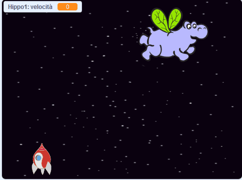

## Ippopotami spaziali

Ora aggiungerai un sacco di ippopotami volanti che cercano di distruggere la tua astronave.

--- task ---

Crea un nuovo sprite con l'immagine 'Hippo1' nella collezione di Scratch. Usa lo strumento di **riduzione** per rendere l'`ippopotamo` di dimensioni simili alla `Navicella`.


--- /task ---

--- task ---

Imposta la rotazione dello sprite dell'`ippopotamo` a **sinistra-destra**.

[[[generic-scratch3-sprite-rotation-style]]]

--- /task ---

--- task ---

Aggiungi del codice per nascondere lo sprite `ippopotamo` quando inizia il gioco.


```blocks3
when green flag clicked
hide
```

--- /task ---

--- task ---

Aggiungi del codice alla scena per creare un nuovo clone di un `ippopotamo` ogni volta che passa qualche secondo.

--- hints ---

--- hint ---

Quando si fa clic sulla `bandiera verde`{:class="block3events"}, `ripetutamente` `aspetta`{:class="block3control"} `tra 2 e 4 secondi`{:class="block3operators"} e poi `crea un clone dello sprite dell'ippopotamo`{:class="block3control"}.

--- /hint ---

--- hint ---

Qui ci sono i blocchi di codice che ti serviranno:

```blocks3
forever
end

create clone of (Ippopotamo v)

(pick random (2) to (4))

when flag clicked

wait () secs
```

--- /hint ---

--- hint ---

Ecco come dovrebbe apparire il risultato:


```blocks3
when flag clicked
forever
	wait (pick random (2) to (4)) secs
	create clone of (Ippopotamo v)
end
```

--- /hint ---

--- /hints ---

--- /task ---

Ogni nuovo clone di ippopotamo dovrebbe apparire in modo casuale in una posizione `x`, ed ogni clone dovrebbe avere una velocità casuale.

--- task ---

Crea una nuova variabile chiamata `velocità`{:class="block3variables"} che verrà usata solo dallo sprite dell'`ippopotamo`.

[[[generic-scratch3-add-variable]]]

Quando lo hai fatto correttamente, la variabile ha il nome dello sprite accanto ad esso, in questo modo:


--- /task ---

--- task ---

Quando ogni `ippopotamo` inizia a clonarsi, scegli una velocità casuale e il suo punto di partenza. Quindi fai apparire il clone sullo schermo.

```blocks3
when I start as a clone
set [velocità v] to (pick random (2) to (4))
go to x: (pick random (-220) to (220)) y: (150)
show
```

--- /task ---

--- task ---

Prova il codice. Appare un nuovo ippopotamo ogni volta che passa qualche secondo?

--- /task ---

Al momento gli ippopotami non si muovono.

--- task ---

Ogni ippopotamo dovrebbe muoversi in modo casuale finché non verrà colpito da un fulmine. Per far si che questo accada, collega questo codice sotto ai blocchi già esistenti che si trovano già nello script di codice dello sprite dell'`ippopotamo`:

```blocks3
repeat until <touching (Fulmine v) ?>
	move (velocità :: variables) steps
	turn right (pick random (-10) to (10)) degrees
	if on edge, bounce
end
delete this clone
```

--- /task ---

--- task ---

Riprova il codice. Adesso dovresti vedere un nuovo clone di ippopotamo che appare ogni pochi secondi, e ogni clone dovrebbe muoversi con una velocità diversa.

--- no-print ---



--- /no-print ---

--- /task ---

--- task ---

Adesso proviamo i cannoni laser dell'astronave. Se un fulmine colpisce un ippopotamo, lui scompare?

--- /task ---