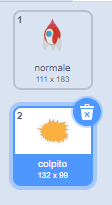
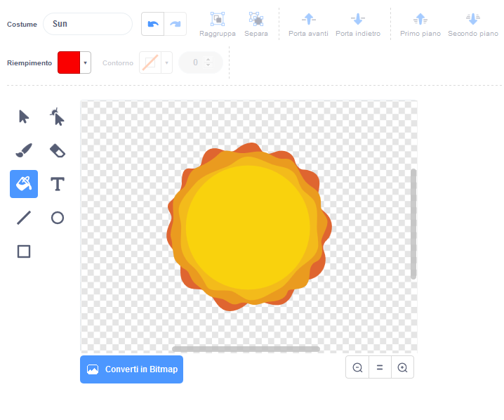

## Esplosione della nave spaziale

Quando un ippopotamo tocca la navicella, la navicella dovrebbe esplodere!

--- task ---

Seleziona lo sprite della `Navicella` e rinomina il suo costume 'normale'.

--- /task ---

--- task ---

Disegna un altro costume di una navicella che esplode, e chiama il nuovo costume 'colpito'.



Se non vuoi disegnare l'esplosione, puoi selezionare il costume del 'sole' dalla libreria di Scracth, e poi usa lo strumento **Colora una forma** per cambiare il colore e la faccia del costume.



--- /task ---

--- task ---

Aggiungi un po' di codice allo sprite della tua `Astronave` così che faccia vedere il costume 'normale' quando il gioco parte, e cambi a 'colpito' quando un ippopotamo la colpisce:


```blocks3
when flag clicked
switch costume to (normale v)
wait until <touching (Ippopotamo v)>?
switch costume to (colpito v)
```

--- /task ---

--- task ---

Prova il codice. Fai si che la navicella si scontri con un ippopotamo. La navicella cambia il costume a 'colpito'?

--- /task ---