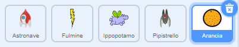

## Pipistrello spaziale

Per rendere il tuo gioco un po' più difficile, creerai un pipistrello che lancia arance alla navicella.


--- task ---

Aggiungi uno sprite `Bat` (Pipistrello) e imposta la sua rotazione su **sinistra-destra**.

--- /task ---

--- task ---

Fai in modo che lo sprite `Pipistrello` si `muova`{:class="block3motion"} da sinistra a destra nella parte superiore dello Stage `per sempre`{:class="block3control"}.


```blocks3
when flag clicked
set size to (50) %
forever
    move (10) steps
    if on edge, bounce
end
```

Ricorda di provare il tuo codice.

--- /task ---

Se guardi i costumi del pipistrello, puoi vedere che ne ha quattro diversi:


--- task ---

Usa il blocco `prossimo costume`{:class="block3looks"} per far si che il pipistrello batta le ali quando si muove.

--- hints ---

--- hint ---

Dopo che il pipistrello è stato spostato, dovrebbe mostrare il `costume successivo`{:class="block3looks"} e poi `attendere`{:class="block3control"} per poco tempo.

--- /hint ---

--- hint ---

Devi aggiungere questi blocchi al tuo codice:

```blocks3
wait (0.3) seconds

next costume
```

--- /hint ---

--- hint ---

Il tuo codice dovrebbe assomigliare a questo:

```blocks3
when flag clicked
set size to (50) %
forever
move (10) steps
if on edge, bounce
+ next costume
+ wait (0.3) seconds
end
```

--- /hint ---

--- /hints ---

--- /task ---

Ora fai in modo che il pipistrello lanci le arance!

--- task ---

Aggiungere lo sprite `Orange` (Arancia) dalla libreria di Scratch.



--- /task ---

--- task ---

Aggiungi del codice al tuo pipistrello in modo che `quando si fa clic sulla bandierina`{:class="block3events"}, lo sprite `Pipistrello` `attenda`{:class="block3control"} `per sempre`{:class="block3control"} per un intervallo di tempo `casuale`{:class="block3operators"} `da 5 a 10`{:class="block3operators"} secondi e poi `crei un clone`{:class="block3control"} dello sprite dell'`Arancia`.


```blocks3
when flag clicked
forever
	wait (pick random (5) to (10)) secs
	create clone of (Arancia v)
end
```

--- /task ---

--- task ---

Aggiungi codice all'`Arancia` per far cadere ogni clone, partendo dallo sprite del `Pipistrello` e fallo cadere verso il fondo dello Stage.


```blocks3
    when flag clicked
	hide

	when I start as a clone
	go to (Pipistrello v)
	show
	repeat until <touching (edge v)?
		change y by (-4)
	end
	delete this clone
```

--- /task ---

--- task ---

Aggiungi altro codice allo sprite dell'`arancia` in modo che quando un suo clone colpisce lo sprite della `navicella`, anche il clone scompare così da dare al giocatore la possibilità di ricominciare:


```blocks3
    when I receive [colpito v]
	delete this clone
```

--- /task ---

--- task ---

Modifica il codice dello sprite della `Navicella` in modo che sia "colpito" quando tocca lo sprite di un `Ippopotamo` o uno sprite dell'`Arancia`:


```blocks3
    wait until < <touching (Ippopotamo v)?> or <touching (Arancia v)?>>
```

--- /task ---

--- task ---

Prova il tuo gioco. Cosa succede se l'astronave viene colpita da un arancia che cade?

--- /task ---