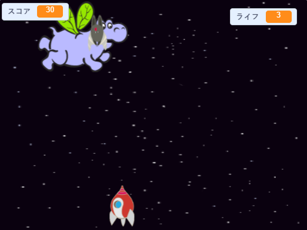

\--- no-print \---

これはプロジェクトの **Scratch 3** バージョンです。プロジェクト</a>Scratch 2バージョンもあります。
 

\--- /no-print \---

## はじめに

このプロジェクトでは、宇宙のかいぶつから地球を救うゲームを作ります。

### 作るもの

\--- no-print \---

下のゲーム例の緑色の旗をクリックして開始し、次に <kbd>左</kbd> と <kbd>右</kbd> 矢印キーを押して宇宙船を移動し、 <kbd>スペース</kbd> キーを押して射撃します。

  <iframe allowtransparency="true" width="485" height="402" src="https://scratch.mit.edu/projects/embed/276887163/?autostart=false" frameborder="0" scrolling="no"></iframe>
  

\--- /no-print \---

飛んでスペースカバを撮影することによってあなたができる限り多くのポイントを獲得。あなたがカバやコウモリによって落とされたオレンジによって打たれるならば、あなたは命を失います。

\--- print-only \---

\--- /print-only \---

## \--- collapse \---

## title: What you will need

### ハードウェア

+ Scratch 3を実行できるコンピュータ

### ソフトウェア

+ Scratch 3 ([オンライン](https://rpf.io/scratchon){:target="_blank"}または[オフライン](https://rpf.io/scratchoff){:target="_blank"})

### ダウンロード

[Find the downloads here](http://rpf.io/p/en/clone-wars-go).

\--- /collapse \---

## \--- collapse \---

## title: What you will learn

+ キーボード入力を使ってスプライトを動かす方法
+ スプライトを複製してコピーする方法
+ メッセージを送信するための 'broadcast'と 'receive blocks'の使い方

\--- /collapse \---

## \--- collapse \---

## title: Additional notes for educators

\--- no-print \---

If you need to print this project, please use the [printer-friendly version](https://projects.raspberrypi.org/en/projects/clone-wars/print){:target="_blank"}.

\--- /no-print \---

You can find the [completed project here](http://rpf.io/p/en/clone-wars-get).

\--- /collapse \---