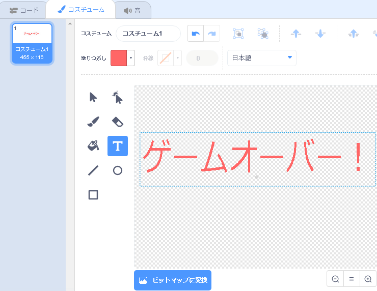
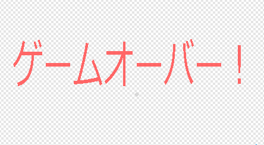

## Game Over!（ゲーム終了）

次に、ゲーム終了時に「ゲームオーバー」のメッセージを追加します。

課題

まだ行っていない場合は、 「生命」という新しい変数を作成します。

あなたの宇宙船は3つの「生命」から始まり、カバやオレンジに触れるたびに命を落とします。 ３つの命を使い切ってしまうと、ゲームは停止します。

課題

課題

テキストツールを使って「ゲームオーバー（Game Over!）」という新しいスプライトを作りましょう。



課題

課題

ステージ上で、ゲームが終了する直前に「ゲームオーバー」のメッセージを送信します。


```blocks3
「ゲームオーバー」のメッセージを送信して待ちます。
```

課題

課題

ゲーム終了時に表示されるように、このコードを「ゲームオーバー」のスプライトに追加します。



```blocks3
緑の旗がクリックされたとき
隠す

「ゲームオーバー 」のメッセージを受け取ったとき
表示する
```

「ゲームオーバーを送って待つ」ブロックを使ったので、ステージはゲームオーバースプライトが表示されるのを待ってからゲームを終了します。

課題

課題

ゲームをテストしてください。何ポイント獲得できますか？ゲームが簡単すぎる、または難しすぎる場合、あなたはそれを改善する方法を考えることができますか？

課題