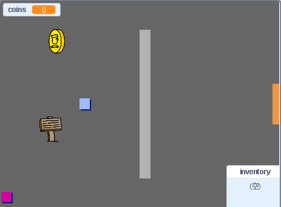

## 次は何をしますか？

当社で行くを持っ [作成し、独自の世界](https://projects.raspberrypi.org/en/projects/create-your-own-world?utm_source=pathway&utm_medium=whatnext&utm_campaign=projects) あなたがあなた自身のアドベンチャーゲームを作成しますプロジェクト、！

\---印刷なし\---

緑色の旗をクリックして開始します。 あなたのキャラクターを世界中に動かすには矢印キーを使ってください。

  <iframe allowtransparency="true" width="485" height="402" src="https://scratch.mit.edu/projects/embed/258757783/?autostart=false" frameborder="0" scrolling="no"></iframe>
  

\--- / no-print \---

\---印刷専用\---

あなたは世界中であなたのキャラクターを動かすために矢印キーを使うでしょう。 

\--- / print-only \---