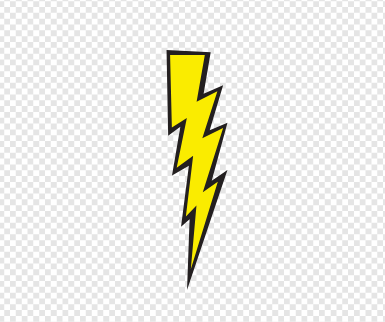

## いなずま

今、あなたは宇宙船に稲妻を発射する能力を与えようとしています！

\--- 課題 \---

スクラッチのライブラリーから「いなずま（Lightning）」のスプライトを追加します。

[[[スクラッチのスプライトのライブラリ]]]

\--- /課題 \---

\--- 課題 \---

ゲームが始まるとき、宇宙船がレーザー砲を発射するまで 「いなずま（Lightning）」の スプライトは隠されているべきです。

このコードを「いなずま（Lightning）」の スプライトに追加します。



```blocks3
緑の旗が押されたとき
隠す
```

\--- /課題 \---

現時点では、いなずま（稲妻）は宇宙船に比べて本当に大きいです！

\--- 課題 \---

「いなずま（Lightning）」の スプライトが既に持っているコードの下に、スプライトを小さくして逆さにするためにいくつかのブロックを追加します。


```blocks3
大きさを（25）％にする
(-90）度に向ける
```

今は宇宙船から先のとがった端を発射するように見えます。

\--- /課題 \---

\--- 課題 \---

<kbd>スペース</kbd> キーを押した場合は、 `宇宙船` スプライトに新しいコードを追加して稲妻の新しいクローンを作成します。

\--- ヒント \---

\--- hint \---

`緑のフラグをクリックすると`{：クラス= "block3eventsを"}、チェックし続ける `永久`{：クラス= "block3control"} `であれば`{：クラス= "block3control"} `スペースキーが押された`{。クラス=「block3sensing」}、その場合 `雷のクローン作成`{：クラス=「block3control」}スプライト。

\--- /ヒント \---

\--- hint \---

必要なブロックは次のとおりです。

```blocks3
フラグがクリックされたとき <> そして
終わり

永遠に
終わり

（Lightning v）

<key (space v) pressed?>

クローンを作成する
```

\--- /ヒント \---

\--- hint \---

新しいコードは次のようになります。


```blocks3
旗が永遠に
クリックしたとき
 <key (space v) pressed?> なら
        （Lightning v）のクローンを作成する
    end
end
```

\--- /ヒント \---

\--- /ヒント \---

\--- /task \---

\--- task \---

ゲームが `Lightning` スプライトクローンを作成するたびに、そのクローンは出現し、それがステージのトップに達するまで上方に動くはずです。クローンは消えます。

このコードを `Lightning` スプライトに追加すると、クローンがステージの端に触れるまで上に移動し、削除されます。


```blocks3
    私はクローンとして起動したときに
    （宇宙船V）へ行く
    ショー
    反復まで <touching (edge v) ?>
        （10）によって変化Y
    端
    このクローンを削除します
```

\--- /task \---

\--- task \---

稲妻が正しく動くかどうかテストするために <kbd>スペース</kbd> キーを押してください。

\--- /task \---