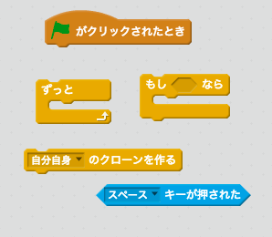
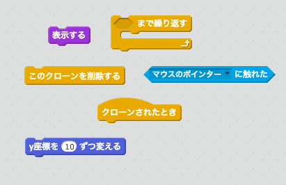

## いなずま

スペースシップがいなずまをうてるようにしましょう！

+ スクラッチのライブラリーから`いなずま`のスプライト（Lightning）を追加します。

+ スペースシップがうちはじめるまでいなずまのスプライトを隠した状態にしましょう。そのために以下のコードを`いなずま`のスプライトに追加してください：

```blocks
⚑ がクリックされたとき
隠す
```

現時点では、いなずまが大きすぎです！スペースシップがうってもいなずまをうっているように見えません！

+ `いなずま`を小さくし、ひっくり返すコードを先ほど加えたコードの下にたしてください。これでスペースシップからいなずまがうたれているようにみえるでしょう。

```blocks
大きさを (25) % にする
(-90 v) 度に向ける
```

+ `スペースシップ`のスプライトをスプライトパネルからせんたくしてください（クリック）。

+ **スペース**キーを押したら`スペースシップ`がいなずまをうつようにするコードを加えましょう。

\--- hints \--- \--- hint \--- ヒントのコードです：

みどりのはたがクリックされたとき、スペースキーが押されたかずっと確認する。もしスペースキーが押されたら`いなずま`のスプライトをクローン（追加）。 \--- /hint \--- \--- hint \--- 必要なコードは下記です：

 \--- /hint \--- \--- hint \--- 必要なコード：

```blocks
⚑ がクリックされたとき
ずっと 
  もし <[スペース v] キーが押された> なら 
    [Lightning v] のクローンを作る
  end
end
```

\--- /hint \--- \--- /hints \---

+ それではスペースキーを押して`いなずま`が正しくうたれているかテストしましょう！

+ いなずまのスプライトは表示された瞬間、画面上の端（はじ）にふれるまで上に移動するはずです。画面のはじにたどり着いたら画面から消えるはずです。

\--- hints \--- \--- hint \---

いなずまのスプライトがクローンされたとき：

+ いなずまのスプライトを表示する。
+ 画面の端にふれるまで、上にスプライトを`10` マスずつ動かす。
+ いなずまのスプライトが画面の端にふれたら、消えるようにする。 \--- /hint \--- \--- hint \--- 必要なコードブロック：

 \--- /\--- /hint \--- \--- hint \--- `いなずま`のスプライトを画面に表示し、移動させるコードは以下のとおりです：

```blocks
    クローンされたとき
表示する
<[端 v] に触れた> まで繰り返す 
  y座標を (10) ずつ変える
end
このクローンを削除する
```

\--- /hint \--- \--- /hints \---

+ いなずまのスプライトをテストしてみましょう。みどりのはたをまずクリックし、その後**スペース**キーを押してください。 **スペース**キーを押すと、いなずまのスプライトは表示され、上に移動してますか？ 問題を発見できましたか？

## \--- collapse \---

## title: 答え

おっと！スペースシップの位置にかぎらず、いなずまはつねに同じいちからうたれています！

下のブロックを`表示する`{:class="blocklooks"} ブロックの上に追加しましょう。表示される前に、いなずまの位置をスペースシップの位置にあわせるコードです。 これでいなずまがスペースシップからうたれてるように見えますね。

```blocks
[Spaceship v] へ行く
```

\--- /collapse \---

+ それでは**スペース**キーを押していなずまが正しくうたれているかテストしましょう！

\--- challenge \---

### チャレンジ：いなずまを直そう

もしスペースキーを押しつづけたらどうなりますか？`待つ`{:class="blockcontrol"}のブロックでなおせますか？

\--- /challenge \---