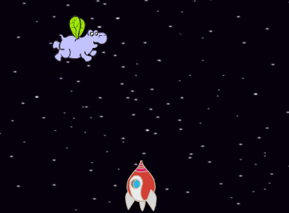
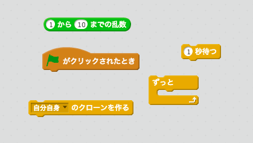
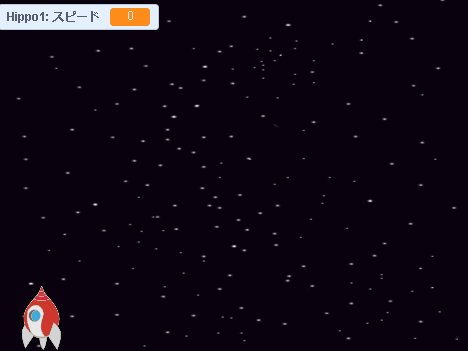

## とべるスペースカバ

あなたのスペースシップを攻撃してくる、とべるスペースカバをたくさん作りましょう！

+ • スクラッチのライブラリの中の `カバ`のスプライト（Hippo1）をステージにたしてください。 **「縮小」**のツールで カバのスプライトを`スペースシップ`ぐらいの大きさまで縮めてください。



+ `カバ`のスプライトの回転種類を左右だけに設定しましょう。

[[[generic-scratch-sprite-rotation-style]]]

+ ゲームが始まったとき、 `カバ`のスプライトを隠したじょうたいにするコードを加えましょう。

\--- hints \--- \--- hint \--- `いなずま`のスプライト（Lightning）を隠すために加えたコードと似たようなものです。 \--- /hint \--- \--- hint \--- 必要なコード：

```blocks
⚑ がクリックされたとき
隠す
```

\--- /hint \--- \--- /hints \---

+ 下のパネルでステージを選んでください。

+ ステージが数秒ごとにゲームに新しいカバを追加するコードを加えましょう。

\--- hints \--- \--- hint \--- みどりのはたがクリックされたとき： くりかえし。。。

+ 2〜4秒待つ
+ カバのスプライトをクローンする

\--- /hint \--- \--- hint \--- 必要なコードブロック：

\--- /hint \--- \--- hint \--- 必要なコード：

```blocks
⚑ がクリックされたとき
ずっと 
  ((2) から (4) までの乱数) 秒待つ
  [Hippo1 v] のクローンを作る
end
```

\--- /hint \--- \--- /hints \---

+ `カバ`のスプライトを選んでください。

ランダムな位置に新しいカバを作りましょう。カバはランダムな速度で動くようにしてください。

+ 新しい変数 `speed`{:class="blockdata"} を作りましょう。この変数はカバのスプライトの速度をあらわす変数です。

[[[generic-scratch-add-variable]]]

以下のように変数が表示されていれば正しく作られています：


+ クローンされたかばがランダムな位置に表示され、ランダムなスピードで動くようにしましょう。

```blocks
クローンされたとき
[スピード v] を ((2) から (4) までの乱数) にする
x座標を ((-220) から (220) までの乱数) 、y座標を (150) にする
表示する
```

+ みどりのはたをクリックしてゲームを実行してください。新しいカバが数秒ごとにあらわれましたか？今のところカバは動かないじょうたいです。

+ カバはいなづまに打たれるまで、ずっとランダムに動くよう設定してください。以下のコードを加えましょう。

```blocks
<[lightning v] に触れた> まで繰り返す 
  (スピード) 歩動かす
  ↻ ((-10) から (10) までの乱数) 度回す
  もし端に着いたら、跳ね返る
end
このクローンを削除する
```

+ ゲームを実行しましょう！数秒ごとに新しいカバが現れ、様々なスピードで動いてますか？
    
    

+ いなづまをテストしましょう！カバに当たったらカバは消えますか？