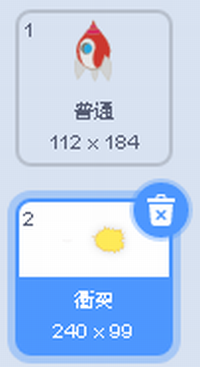

## ばくはつするスペースシップ

カバにぶつかたらスペースシップがばくはつするようにしましょう！

+ `スペースシップ`のスプライト（Spaceship）を選んでコスチュームの名前を「普通」に変えて下さい。

+ ばくはつしたよきのスペースシップのコスチュームを描いてみましょう。「当たった」という名前をコスチュームにつけましょう。



ばくはつしたスペースシップを描きたくない場合、スクラッチのライブラリーから「Sun」コスチュームを選んで**「図形の色」**のツールで太陽の顔を消し、色を変えましょう。そうするとばくはつのようなコスチュームを作れます。


+ カバにぶつかたらスペースシップのコスチュームが「普通」から「当たった」に変わるようにしましょう。`スペースシップ`のスプライトにコードを加えます：

```blocks
⚑ がクリックされたとき
コスチュームを [普通 v] にする
<[Hippo1 v] に触れた> まで待つ
コスチュームを [当たった v] にする
```

+ ゲームを実行しましょう。スペースシップがカバにぶつかったとき、スペースシップは「当たった」というコスチュームに変わりますか？