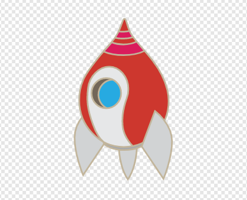
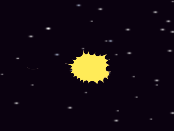

## 消えるカバ

宇宙船が爆発すると、プレイヤーが回復できるようにすべてのカバが消えるようにします。

\--- 課題 \---

宇宙船のスプライトにコードを追加します。 「コスチュームをSunにする」の下に「メッセージ１を送る」を入れます。 新しいメッセージ内容は「衝突した」とします。



```blocks3
緑の旗が押されたとき
コスチュームを（通常）にする
カバに触れたまで待つ
コスチュームを衝突にする
「衝突した」のメッセージを送る
```

\--- /課題 \---

\--- 課題 \---

カバのスプライトクローンはすべて 「衝突した」のメッセージを受け取ります、そしてこのコードをカバのスプライトに追加することで、宇宙船が衝突したときに消えるように指示することができます。


```blocks3
「衝突した」のメッセージを受け取ったとき
このクローンを削除する
```

\--- /課題 \---

\--- 課題 \---

新しいコードが機能するかどうかを確認するには、緑色の旗を押して宇宙船をカバと衝突させます。



\--- /課題 \---

宇宙船が爆発した後、新しい `カバ` クローンが現れるが、宇宙船はまだ爆発している！宇宙船は命中後に自分自身をリセットする必要があります。

\--- task \---

`Spaceship` スプライトのコードの最後に `wait`{：class = "block3control"}ブロックを追加して、カバが再び表示される前に小さな一時停止を作成します。 次に、コードを繰り返し実行するために、すべてのコードの周囲に永久に `追加します`{：class = "block3control"}ブロック。


```blocks3
flagがいつまでも
クリックしたとき
衣装を（通常のv）に切り替える
 <touching (Hippo1 v)>まで待つ？
衣装を（ヒットv）
ブロードキャスト（ヒットv）

+待機（1）秒
切り替える
```

\--- /task \---