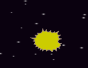

## 消えるカバ

宇宙船が爆発すると、プレイヤーが回復できるようにすべてのカバが消えるようにします。

\--- 課題 \---

宇宙船のスプライトにコードを追加します。 「コスチュームをSunにする」の下に「メッセージ１を送る」を入れます。 新しいメッセージ内容は「衝突した」とします。


```blocks3
緑の旗が押されたとき
コスチュームを（通常）にする
カバに触れたまで待つ
コスチュームを衝突にする
「衝突した」のメッセージを送る
```

\--- /課題 \---

\--- 課題 \---

カバのスプライトクローンはすべて 「衝突した」のメッセージを受け取ります、そしてこのコードをカバのスプライトに追加することで、宇宙船が衝突したときに消えるように指示することができます。


```blocks3
「衝突した」のメッセージを受け取ったとき
このクローンを削除する
```

\--- /課題 \---

\--- 課題 \---

新しいコードが機能するかどうかを確認するには、緑色の旗を押して宇宙船をカバと衝突させます。



\--- /課題 \---

宇宙船が爆発した後、新しいカバのクローンが現れますが、宇宙船はまだ爆発しています！宇宙船は命中後に自分自身をリセットする必要があります。

\--- 課題 \---

宇宙船のスプライトのコードの最後に「待つ」ブロックを追加します。 これで宇宙船は、カバが再び表示される前に、小さく一時停止します。 次に、緑の旗ブロックの下を「ずっと」ブロックで囲み、コードを繰り返し実行します。


```blocks3
緑の旗が押されたとき
ずっと
コスチュームを通常にする
カバに触れたまで待つ
コスチュームを衝突にする
「衝突した」を送る
1秒待つ
```

\--- /課題 \---