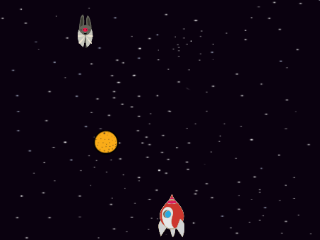
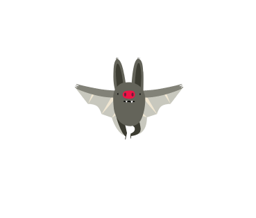
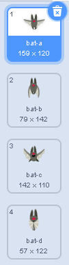
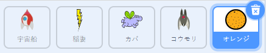
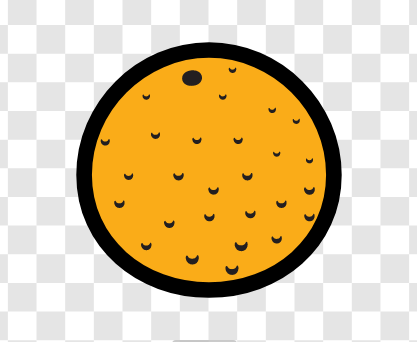

## 宇宙コウモリ

あなたのゲームを少し難しくするために、あなたは宇宙船でオレンジを投げるコウモリを作成します。



\--- 課題 \---

コウモリのスプライトを追加して、回転スタイルを左右のみにします。

\--- /課題 \---

\--- 課題 \---

コウモリのスプライト は、ステージの最上部をずっと左右に動いているようにします。



```blocks3
緑の旗が押されたとき
大きさを（50）％にする
ずっと
    （10）歩動かす
    もし端に着いたら、跳ね返る
```

コードをテストするのを忘れないでください。

\--- /課題 \---

あなたがコウモリのコスチュームを見れば、あなたはそれが4つの異なるものを持っていることがわかります：



\--- 課題 \---

「次のコスチュームにする」のブロックを使用して、コウモリが動くにつれて羽を羽ばたかせるように見せます。

\--- ヒント \---

\--- ヒント \---

コウモリが動いた後、次のコスチュームが表示され、しばらく待つ必要があります。

\--- /ヒント \---

\--- ヒント \---

これらのブロックをコードに追加する必要があります。

```blocks3
0.3秒待つ
次のコスチュームにする

```

\--- /ヒント \---

\---ヒント\--- コードは次のようになります。

```blocks3
緑の旗が押されたとき
大きさを（50）％にする
ずっと
（10）歩動かす
もし端に着いたら、跳ね返る
次のコスチュームにする
+次の衣装
（0.3）秒待つ
```

\--- /ヒント \---

\--- /ヒント \---

\--- /課題 \---

コウモリがオレンジを投げるようにします！

\--- 課題 \---

スクラッチライブラリから オレンジのスプライトを追加します。



\--- /課題 \---

\--- 課題 \---

緑の旗が押されたとき ずっと 5から10までの乱数秒待つ オレンジのクローンを作る


```blocks3
緑の旗が押されたとき
ずっと
5から10までの乱数秒待つ
オレンジのクローンを作る
```

\--- /課題 \---

\--- 課題 \---

コウモリはオレンジを落とすようにします。 ライブラリからオレンジのスプライトを追加します。



```blocks3
    緑の旗が押されたとき
隠す

クローンされたとき
    （コウモリ）へ行く
    表示する
    端に触れたまで繰り返す
    y座標を（-4）ずつ変える
　このクローンを削除する
```

\--- /課題 \---

\--- 課題 \---

オレンジのスプライトにさらにコードを追加して、オレンジのクローンが宇宙船に当たったときにもクローンを消して、プレーヤーにリセットの機会を与えます。


```blocks3
    「衝突した」のメッセージを受け取ったとき
このクローンを削除する
```

\--- /課題 \---

\--- 課題 \---

宇宙船のスプライトのコードを修正して、 カバのスプライトまたはオレンジのスプライトに触れたときに、そのスプライトが爆発するようにします。


```blocks3
    カバに触れた または オレンジに触れた まで待つ
```

\--- /課題 \---

\--- 課題 \---

ゲームをテストしてください。宇宙船がオレンジの落下に当たったら、どうなりますか？

\--- /課題 \---