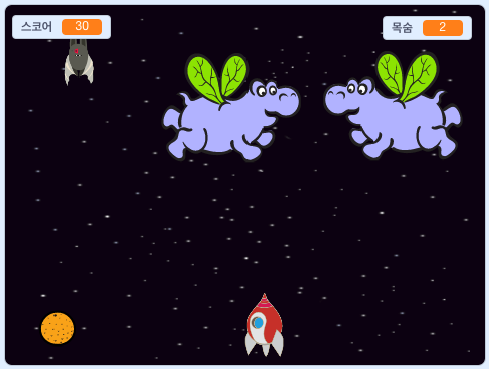

\--- no-print \---

이것은 **스크래치 3** 버전의 프로젝트입니다. [스크래치 2 버전의 프로젝트도 있습니다](https://projects.raspberrypi.org/en/projects/clone-wars-scratch2).

\--- /no-print \---

## 소개

이 프로젝트에서는 외계생명체의 지구 침공을 막는 게임을 만드는 법을 배웁니다.

### 만들 작품

\--- no-print \---

예를 들어 게임 화면 아래쪽에 등장하는 녹색 깃발을 클릭 한 다음 키를 누르는 것으로 게임을 시작합니다 <kbd>왼쪽</kbd> 및 <kbd>오른쪽</kbd> 이동 키는 화살표 키입니다. 그리고 <kbd>스페이스</kbd> 키는 공격 키입니다.

  <iframe allowtransparency="true" width="485" height="402" src="https://scratch.mit.edu/projects/embed/276887163/?autostart=false" frameborder="0" scrolling="no"></iframe>
  

\--- /no-print \---

우주 공간을 헤엄치고 있는 하마를 쏴서 가능한 한 많은 점수를 얻으십시오. 하마에게 공격을 당하거나 박쥐가 떨어뜨린 오렌지에 맞으면 생명력이 줄어듭니다.

\--- print-only \---

\--- /print-only \---

## \--- collapse \---

## title: What you will need

### 하드웨어

+ 스크래치 3을 실행할 수 있는 컴퓨터

### 소프트웨어

+ 스크래치 3 ( [온라인](https://rpf.io/scratchon){:target="_ blank"} 또는 [오프라인](https://rpf.io/scratchoff){:target="_ blank"})

### 다운로드

[Find the downloads here](http://rpf.io/p/en/clone-wars-go).

\--- /collapse \---

## \--- collapse \---

## title: What you will learn

+ 키보드를 활용하여 스프라이트를 이동시키는 방법
+ 스프라이트를 복제하는 방법
+ '브로드캐스트' 및 '블록 수신' 기능을 사용하여 메시지를 보내는 방법

-- /collapse \---

## \--- collapse \---

## title: Additional notes for educators

\--- no-print \---

If you need to print this project, please use the [printer-friendly version](https://projects.raspberrypi.org/en/projects/clone-wars/print){:target="_blank"}.

\--- /no-print \---

You can find the [completed project here](http://rpf.io/p/en/clone-wars-get).

\--- /collapse \---