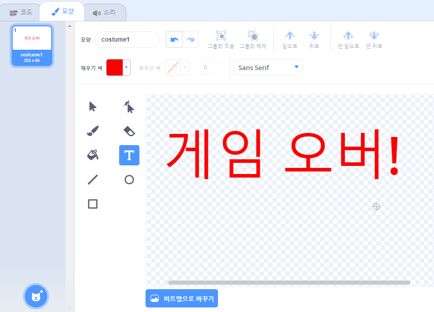
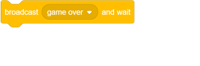
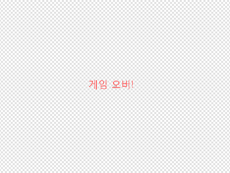
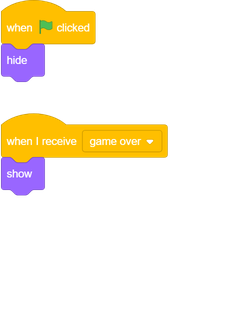

## 게임 끝

다음으로, 게임이 끝날 때 '게임 오버'메시지를 추가 할 것입니다.

\--- task \---

아직 없으면 `lives`{: class = "block3variables"}라는 새 변수를 만듭니다.

당신의 우주선은 3 개의 생명으로 시작해야하며, 하마 또는 오렌지에 닿으면 언제든지 생명을 잃을 것입니다. ``{{class = "block3variables"}에 달하면 게임이 멈춰야합니다.

\--- /task \---

\--- task \---

**텍스트** 도구를 사용하여 `Game Over` 이라는 새로운 스프라이트를 그립니다.

\--- /task \---

\--- task \---

스테이지에, 방송 `을 통해 게임을`게임이 종료 직전에 메시지 : {클래스 = "block3events"}.

\--- /task \---

\--- task \---

당신이 코드를 추가 `게임 오버` 이 게임의 끝 부분에 표시되도록 스프라이트 :

스테이지에서 `브로드 캐스트를 사용하고`{: class = "block3events"} 블록을 기다렸으므로 스테이지는 게임 종료 전에 `Game Over` 스프라이트가 표시 될 때까지 기다립니다.

\--- /task \---

\--- task \---

게임을 테스트 해보십시오. 얼마나 많은 점수를 얻을 수 있습니까? 게임이 너무 쉽거나 어렵다면 게임을 향상시킬 방법을 생각해 볼 수 있습니까?

\--- /task \---