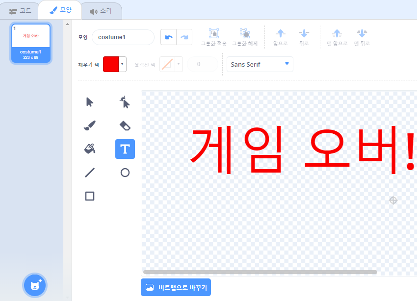

## 게임 오버

다음으로, 게임 종료 시 '게임 오버' 메시지를 추가 할 것입니다.

--- task ---

아직 없을 경우 `목숨`{:class="block3variables"} 이라는 새 변수를 만듭니다.

당신의 우주선은 목숨 3개로 시작되며 하마나 오렌지와 닿으면 목숨을 잃습니다. `목숨`{:class="block3variables"} 을 다 쓰면 게임은 종료되어야 합니다.

--- /task ---

--- task ---

**텍스트** 도구를 사용하여 `게임오버` 이라는 새로운 스프라이트를 그립니다.



--- /task ---

--- task ---

게임 종료 직전 스테이지에 `게임오버`{:class="block3events"} 메세지를 브로드캐스트 합니다.


```blocks3
broadcast (게임오버 v) and wait
```

--- /task ---

--- task ---

다음의 코드를 `게임오버` 스프라이트에 추가해 게임 종료 시 보여지게 하세요:


```blocks3
when flag clicked
hide

when I receive [게임오버 v]
show
```

`(게임오버) 브로드케스트 후 대기`{:class="block3events"} 블록을 스테이지에 사용하였으므로 게임 종료 전 스테이지에서는 `게임오버` 스프라이트 표시가 보여질때까지 대기합니다.

--- /task ---

--- task ---

게임을 테스트 해보십시오. 얼마나 많은 점수를 얻을 수 있습니까? 게임이 너무 쉽거나 어렵다면 게임을 향상시킬 방법을 생각해 볼 수 있습니까?

--- /task ---