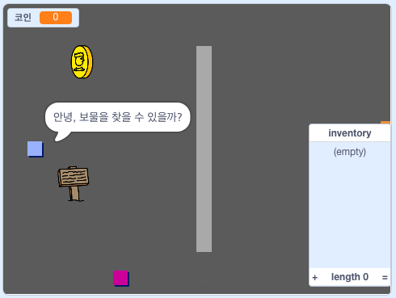

## 더 나아가기

[자신만의 세상 만들기](https://projects.raspberrypi.org/en/projects/create-your-own-world?utm_source=pathway&utm_medium=whatnext&utm_campaign=projects) 프로젝트를 해 보세요!

\--- no-print \---

녹색 깃발을 눌러 시작합니다. 세계에서 당신의 캐릭터를 움직이려면 화살표 키를 사용하십시오.

  <iframe allowtransparency="true" width="485" height="402" src="https://scratch.mit.edu/projects/embed/258757783/?autostart=false" frameborder="0" scrolling="no"></iframe>
  

\--- /no-print \---

\--- print-only \---

화살표 키를 사용하여 세계 곳곳에서 당신의 캐릭터를 움직일 수 있습니다. 

\--- /print-only \---