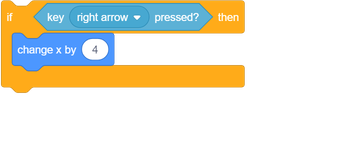

## 우주선을 만드십시오.

지구를 방어 할 수있는 우주선을 만드십시오!

\--- task \---

'복제 전쟁'스크래치 초보 프로젝트를 엽니 다.

**Online :** [rpf.io/clone-wars-on](http://rpf.io/clone-wars-on){: target = "_ blank"}에서 시작 프로젝트를 엽니 다.

**오프라인 :** 다운로드에서 스타터 프로젝트 [rpf.io/p/en/clone-wars-go](http://rpf.io/p/en/clone-wars-go)다음 및 오프라인 편집기를 사용하여 엽니 다.

Scratch 오프라인 편집기를 다운로드하여 설치해야하는 경우 [rpf.io/scratchoff](https://rpf.io/scratchoff){: target = "_ blank"}에서 찾을 수 있습니다.

\--- /task \---

\--- task \---

경우 우주선 이동이 왼쪽으로 만들기 위해 우주선 스프라이트에이 코드를 추가 <kbd>왼쪽</kbd> 화살표를 누르면 :

x 축은 스테이지의 왼쪽에서 오른쪽으로갑니다. 즉, 우주선 스프라이트의 `x` 위치 값에서 빼면 우주선이 왼쪽으로 이동합니다. 따라서이 코드 블록은 우주선을 왼쪽으로 이동시키는 부분입니다.

\--- /task \---

\--- task \---

내부에 좀 더 코드를 추가 `영원히`경우 오른쪽으로 우주선 이동을 만들기 위해 블록 : {클래스 = "block3control"} <kbd>바로</kbd> 화살표 키를 누르면됩니다.

\--- 힌트 \---

\--- hint \---

우주선의 `x` 위치에서 `4` 을 빼면 왼쪽으로 이동 했으므로 어떻게 우주선을 `4` 로 바로 이동할 수 있습니까?

\--- /귀뜸말 \---

\--- hint \---

동일한 코드 블록이 필요하지만 다른 번호가 필요합니다.

\--- /귀뜸말 \---

\--- hint \---

다음은 내부의 다른 코드 아래에 추가해야하는 코드입니다 `영원히`블록 : {클래스 = "block3control은"} :

 \--- / 귀뜸말 \---

\--- / 귀뜸말 \---

\--- /task \---

\--- task \---

녹색 깃발을 클릭하여 프로젝트를 테스트하십시오. 화살표 키를 눌러 우주선을 좌우로 움직일 수 있습니까?

\--- /task \---