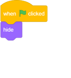

## 번개

이제 당신은 우주선에게 번개를 발사 할 수있는 능력을 부여 할 것입니다!

\--- task \---

`번개` 스프라이트를 스크래치 라이브러리에서 추가하십시오.

[[[generic-scratch3-sprite-from-library]]]

\--- /task \---

\--- task \---

게임이 시작되면 우주선이 레이저 대포를 발사 할 때까지 `번개` 스프라이트를 숨겨야합니다.

`번개` 스프라이트에 다음 코드를 추가하십시오.

\--- /task \---

현재, 번개는 우주선에 비해 정말 큽니다!

\--- task \---

하여 코드 아래 `번개` 스프라이트가 이미 가지고, 스프라이트 작게하고 뒤집어 일부 블록을 추가합니다.

이제 우주선에서 뾰족한 것부터 시작됩니다.

\--- /task \---

\--- task \---

<kbd>스페이스</kbd> 키를 누르면 번개 모양의 새로운 클론을 생성하기 위해 `우주선` 스프라이트에 새로운 코드를 추가하십시오.

\--- 힌트 \---

\--- hint \---

`녹색 플래그가 클릭되면`{CLASS = "block3events를"}, 계속 확인 `영원히`{CLASS = "block3control"} `경우`{CLASS = "block3control"}을 `스페이스 키를 누르면`{ 클래스} "block3sensing", 그 경우 = `번개의 클론 생성`{CLASS = "block3control"} 스프라이트.

\--- / 귀뜸말 \---

\--- hint \---

필요한 블록은 다음과 같습니다.

\--- /귀뜸말 \---

\--- hint \---

다음은 새 코드의 모양입니다.

\--- / 귀뜸말 \---

\--- / 귀뜸말 \---

\--- /task \---

\--- task \---

게임에서 `번개` 스프라이트 복제본이 생성 될 때마다 클론이 나타나야하며 스테이지의 상단에 도달 할 때까지 위쪽으로 이동해야합니다. 그런 다음 클론이 사라져야합니다.

`번개` 스프라이트에이 코드를 추가하여 스테이지의 가장자리에 닿을 때까지 클론이 위로 이동 한 다음 삭제됩니다.

\--- /task \---

\--- task \---

번개가 제대로 움직이는 지 확인하려면 <kbd>칸</kbd> 키를 누르십시오.

\--- /task \---