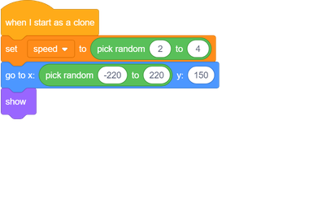

## 우주 - 하마

이제 우주선을 파괴하려고하는 많은 하마를 추가 할 것입니다.

\--- task \---

스크래치 라이브러리에 'Hippo1'이미지가있는 새로운 스프라이트를 만듭니다. **shrink** 도구를 사용하여 `Hippo` 스프라이트를 `Spaceship` 스프라이트와 비슷한 크기로 만듭니다.

\--- /task \---

\--- task \---

`하마` 스프라이트의 회전 스타일을 **왼쪽에서 오른쪽으로 설정하십시오**.

[[[generic-scratch3-sprite-rotation-style]]]

\--- /task \---

\--- task \---

게임 시작시 `하마` 스프라이트를 숨기는 코드를 추가하십시오.

 \--- /task \---

\--- task \---

새로 만들 스테이지에 일부 코드를 추가 `하마` 복제를 몇 초마다.

\--- 힌트 \---

\--- hint \---

`녹색 플래그가 클릭되면`{: class = "block3events"}, `반복`{: class = "block3control"} `대기`{: class = "block3control"} `2 ~ 4 초`{: class = "block3operators"} 다음 `하마 스프라이트의 클론 만들`{: 클래스 = "block3control"}.

\--- / 귀뜸말 \---

\--- hint \---

필요한 블록은 다음과 같습니다.

\--- /귀뜸말 \---

\--- hint \---

이 코드는 다음과 같습니다.

\--- /귀뜸말 \---

\--- / 귀뜸말 \---

\--- /task \---

각각의 새로운 하마 클론은 임의의 `x` 위치에 나타나야하며 모든 클론은 임의의 속도를 가져야합니다.

\--- task \---

`Hippo` 스프라이트에만 해당되는 `speed`{: class = "block3variables"}이라는 새 변수를 만듭니다.

[[[generic-scratch3-add-variable]]]

이 작업을 올바르게 수행하면 변수의 스프라이트 이름이 다음과 같이됩니다.

\--- /task \---

\--- task \---

각각의 경우 `하마` 복제가 시작, 그것을 위해 임의의 속도와 출발점을 선택합니다. 그런 다음 클론을 화면에 표시하십시오.

\--- /task \---

\--- task \---

코드를 테스트하십시오. 몇 초마다 새로운 하마가 나타 납니까?

\--- /task \---

현재 하마는 움직이지 않습니다.

\--- task \---

각 하마는 번개가 치기까지 무작위로 움직여야합니다. 즉, 일어나는 이미 블록 아래에이 코드를 첨부 만들려면 `하마` 스프라이트의 코드 스크립트를 :

\--- /task \---

\--- task \---

코드를 다시 테스트하십시오. 몇 초마다 새로운 하마 복제품이 나타나야하며 각 클론은 다른 속도로 움직여야합니다.

\--- no-print \---

\--- /no-print \---

\--- /task \---

\--- task \---

이제 우주선의 레이저 대포를 시험해보십시오. 번개가 하마를 때리는 경우 하마가 사라지나요?

\--- /task \---