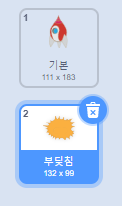
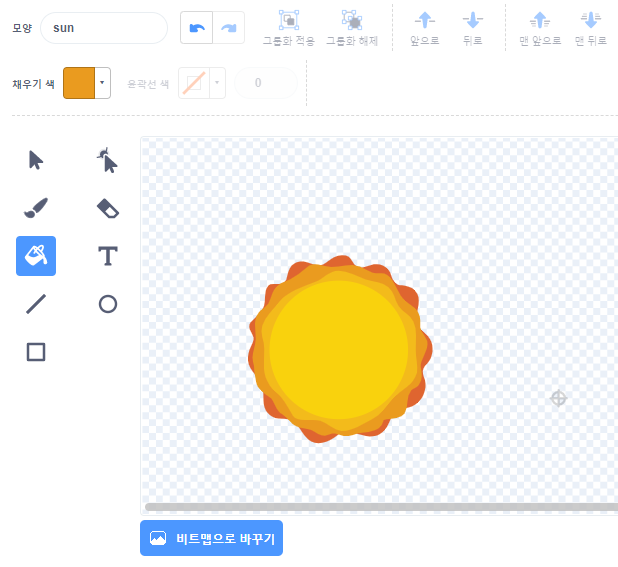
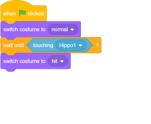

## 우주선 폭발

하마가 우주선에 닿으면 우주선이 폭발해야합니다!

\--- task \---

`우주선` 스프라이트를 선택하고 복장의 이름을 '정상'으로 변경하십시오.

\--- /task \---

\--- task \---

폭발하는 우주선의 또 다른 의상을 그리고 새로운 의상을 '히트'라고 부르십시오.

폭발을 원하지 않는다면 Scratch 라이브러리에서 'Sun'복장을 선택한 다음 **Color a shape** 도구를 사용하여 복장의 색과 얼굴을 바꿀 수 있습니다.

\--- /task \---

\--- task \---

`우주선` 스프라이트에 코드를 추가하여 게임이 시작될 때 '정상'코스튬을 표시하고 하마를 터치하면 '히트'코스튬으로 전환하십시오.

\--- /task \---

\--- task \---

코드를 테스트하십시오. 우주선이 하마와 충돌하게하십시오. 우주선이 '히트'복장으로 바뀌 었습니까?

\--- /task \---