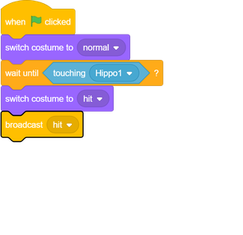
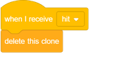
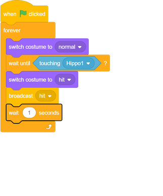

## 사라지는 마

우주선이 폭발하면 모든 하마가 사라져 게임 플레이어가 회복 될 수 있습니다.

\--- task \---

우주선 스프라이트에 코드를 추가하여 `으로 만듭니다.`{: class = "block3events"} `우주선이 하마를 만났을 때 "hit"메시지가`{: class = "block3sensing"}됩니다.

\--- /task \---

\--- task \---

의 모든 `하마` 스프라이트 클론은 "히트"메시지가 나타납니다, 당신은이 코드를 추가하여 우주선이 충돌 할 때 사라하도록 지시 할 수 있습니다 `하마` 스프라이트를 :

\--- /task \---

\--- task \---

새 코드가 작동하는지 확인하려면 녹색 깃발을 클릭하고 우주선을 하마와 충돌 시키십시오.

\--- /task \---

우주선이 폭발 한 후에 새로운 `하마` 클론이 나타나지만 우주선은 여전히 폭발합니다! 우주선은 공격당한 후에 스스로 리셋해야합니다.

\--- task \---

하마가 다시 나타나기 전에 작은 멈춤을 만들기 위해 `우주선` 스프라이트의 코드 끝에 `대기`{: class = "block3control"} 블록을 추가하십시오. 그런 다음 추가 `영원히`반복적으로 코드를 실행할 수 있도록하는 코드의 모든 주위 : {클래스 = "block3control"} 블록을.

\--- /task \---