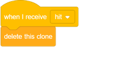

## 우주 박쥐

게임을 조금 더 어렵게 만들려면 우주선에서 오렌지를 던지는 박쥐를 만들어야합니다.

\--- task \---

`박쥐` 스프라이트를 추가하고 회전 스타일을 왼쪽에서 오른쪽으로 **설정하십시오**.

\--- /task \---

\--- task \---

`Bat` 스프라이트 `Stage <code>의 맨 위에서 왼쪽에서 오른쪽으로`{: class = "block3motion"} 영원히</code>{: class = "block3control"} 이동시킵니다.

코드를 테스트하는 것을 잊지 마십시오.

\--- /task \---

박쥐의 의상을 보면 네 가지 의상이 있음을 알 수 있습니다.

\--- task \---

`다음 코스튬`{: class = "block3looks"} 블록을 사용하여 박쥐 날개가 움직이는대로 날개를 만듭니다.

\--- 힌트 \---

\--- hint \---

박쥐가 이동 한 후에는 표시해야합니다 `다음 의상`: {클래스 = "block3looks"} 다음 `대기`짧은 시간 동안 {클래스 = "block3control을"}.

\--- /귀뜸말 \---

\--- hint \---

코드에 다음 블록을 추가해야합니다.

 \--- /귀뜸말 \---

\--- 힌트 \--- 코드는 다음과 같이 보일 것입니다 :

 \--- /귀뜸말 \---

\--- / 귀뜸말 \---

\--- /task \---

이제 배트 던지기 오렌지를 만드십시오!

\--- task \---

스크래치 라이브러리에서 오렌지</code> 스프라이트를 `추가하십시오.

--- /task ---

--- task ---

박쥐에 코드를 추가하여 플래그를 클릭하면 <code>되도록합니다.`{: class = "block3events"}, `박쥐` 스프라이트 `영원히`{: class = "block3control"} `대기`{: class = "block3control"} A의 `랜덤`사이의 시간의 길이 : {CLASS = "block3operators"} `5 10 행`: 다음 {CLASS = "block3operators"} 초 `클론을 생성한다`{CLASS = "block3control"}의 `오렌지` 스프라이트.

\--- /task \---

\--- task \---

`Orange` 에 코드를 추가하여 `Bat` 스프라이트에서 시작하여 스테이지의 아래쪽으로 떨어지는 각각의 복제본을 드롭합니다.

\--- /task \---

\--- task \---

`Orange` 스프라이트에 코드를 더 추가하여 `Orange` 클론이 `Spaceship` 스프라이트에 도달하면 클론 또한 사라져서 플레이어에게 초기화 할 수있는 기회를줍니다.

\--- /task \---

\--- task \---

`Spaceship` 스프라이트의 코드를 수정하여 Sprite가 `Hippo` 스프라이트 또는 `Orange` 스프라이트에 닿을 때 "히트"되도록 수정하십시오 :

\--- /task \---

\--- task \---

게임을 테스트 해보십시오. 우주선이 주황색으로 타격을 받으면 어떻게 될까요?

\--- /task \---