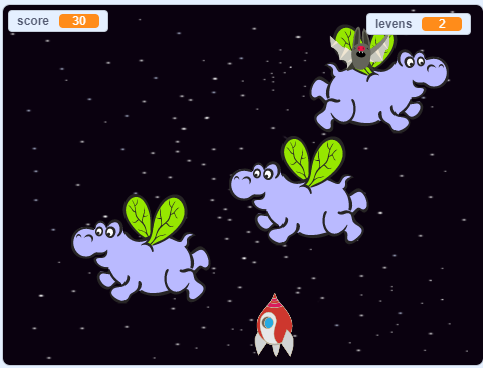

\--- no-print \---

Dit is de **Scratch 3** versie van het project. Er is ook een [Scratch 2 versie van het project](https://projects.raspberrypi.org/en/projects/clone-wars-scratch2).

\--- /no-print \---

## Inleiding

In dit project leer je een spel te maken waarin je de aarde moet redden van ruimtemonsters.

### Wat ga je maken

\--- no-print \---

Klik op de groene vlag in het onderstaande voorbeeld om het spel te starten en druk vervolgens op de pijltjetoets <kbd>links</kbd> en <kbd>rechts</kbd>, om het ruimteschip in de <kbd>ruimte</kbd> te verplaatsen en druk op de spatiebalk om te schieten.

  <iframe allowtransparency="true" width="485" height="402" src="https://scratch.mit.edu/projects/embed/276887163/?autostart=false" frameborder="0" scrolling="no"></iframe>
  

\--- /no-print \---

Scoor zoveel mogelijk punten door op de vliegende ruimte-nijlpaarden te schieten. Je verliest een leven als je wordt geraakt door een nijlpaard of door de sinaasappels die door de fruitvleermuizen worden gegooid.

\--- print-only \---

\--- /print-only \---

## \--- collapse \---

## title: What you will need

### Hardware

+ Een computer die Scratch 3 kan uitvoeren

### Software

+ Scratch 3 (of [online](https://rpf.io/scratchon){:target="_blank"} of [offline](https://rpf.io/scratchoff){:target="_blank"})

### Downloads

[Find the downloads here](http://rpf.io/p/en/clone-wars-go).

\--- /collapse \---

## \--- collapse \---

## title: What you will learn

+ Hoe laat je sprites bewegen met behulp van het toetsenbord
+ Hoe maak je een kopie van een sprite door te klonen
+ Hoe gebruik je 'zend' en 'ontvang signaal blokken' om berichten te verzenden

\--- /collapse \---

## \--- collapse \---

## title: Additional notes for educators

\--- no-print \---

If you need to print this project, please use the [printer-friendly version](https://projects.raspberrypi.org/en/projects/clone-wars/print){:target="_blank"}.

\--- /no-print \---

You can find the [completed project here](http://rpf.io/p/en/clone-wars-get).

\--- /collapse \---