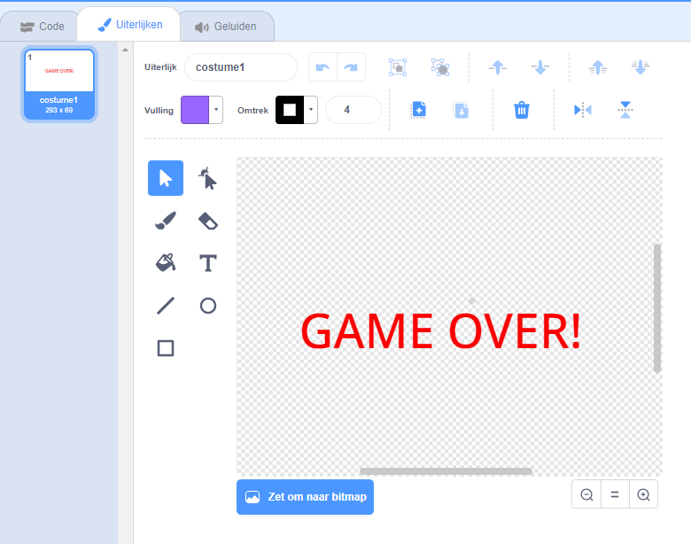

## Wedstrijd voorbij

Vervolgens ga je een 'game over' bericht toevoegen aan het einde van het spel.

\--- task \---

Maak, als je dat nog niet gedaan hebt, een nieuwe variabele met de naam `levens`{:class="block3variables"}.

Je ruimteschip moet met drie levens beginnen en een leven verliezen wanneer het een nijlpaard of sinaasappel raakt. Je spel moet stoppen wanneer de `levens`{:class="block3variables"} op zijn.

\--- /task \---

\--- task \---

Teken een nieuwe sprite genaamd `Wedstrijd voorbij` met behulp van de **tekst** tool.



\--- /task \---

\--- task \---

Maak in het speelveld een `game over`{: class="block3events"} bericht vlak voordat het spel eindigt.


```blocks3
zend signaal (game over v) en wacht
```

\--- /task \---

\--- task \---

Voeg deze code toe aan je `Wedstrijd voorbij` sprite, zodat het bericht aan het einde van het spel verschijnt:


```blocks3
wanneer op de vlag wordt geklikt
verdwijn

wanneer ik signaal [game over v] ontvang
verschijn
```

Omdat je een `zend signaal (game over) en een wacht`{:class="block3events"} blok in je speelveld hebt gebruikt, zal het speelveld wachten op de `Game Over` sprite voordat het spel wordt beëindigd.

\--- /task \---

\--- task \---

Test je spel. Hoeveel punten kun je scoren? Als het te gemakkelijk of te moeilijk is, kun je dan manieren bedenken om je spel te verbeteren?

\--- /task \---