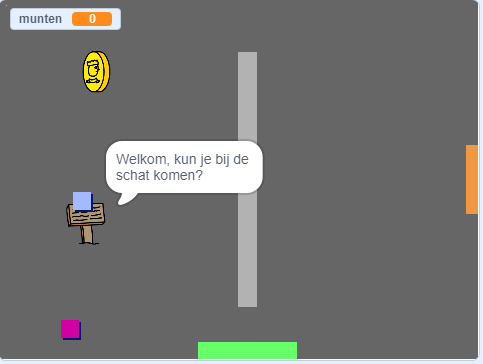

## Hoe nu verder?

Probeer ons [Maak je eigen wereld](https://projects.raspberrypi.org/nl-NL/projects/create-your-own-world?utm_source=pathway&utm_medium=whatnext&utm_campaign=projects) project, waarin je je eigen avonturen spel kunt maken!

--- no-print ---

Klik op de groene vlag om te starten. Gebruik de pijltjestoetsen om je karakter in de wereld te verplaatsen.

  <iframe allowtransparency="true" width="485" height="402" src="https://scratch.mit.edu/projects/embed/258757783/?autostart=false" frameborder="0" scrolling="no"></iframe>
  

--- /no-print ---

--- print-only ---

Je gebruikt de pijltjestoetsen om je karakter in de wereld te verplaatsen. 

--- /print-only ---

**Door de community geleverde vertaling**

Dit project werd vertaald door **Cor Groot** en gecontroleerd door **Jeroen Dekker**/**Robert-Jan Kempenaar**.

Onze geweldige vertalers helpen ons om kinderen over de hele wereld de kans te geven te leren coderen. Jij kunt ons helpen nog meer kinderen te bereiken door onze projecten te vertalen - lees meer op [rpf.io/translators](https://rpf.io/translators).