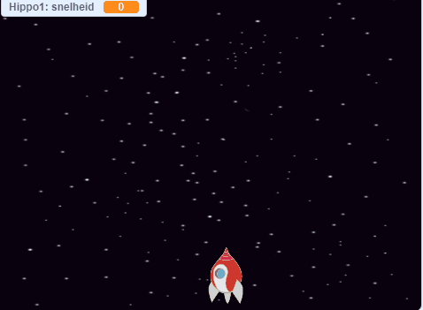

## Vliegende ruimte-nijlpaarden

Nu ga je veel vliegende nijlpaarden (flying hippos) toevoegen die proberen jouw ruimteschip te vernietigen.

--- task ---

Maak een nieuwe sprite met de 'Hippo1' afbeelding in de Scratch bibliotheek. Gebruik de **grootte** instelling om de `Hippo1` sprite even groot als de `Ruimteschip` sprite te maken.


--- /task ---

--- task ---

Stel de `nijlpaard` sprite's draaistijl in op **links-rechts**.

[[[generic-scratch3-sprite-rotation-style]]]

--- /task ---

--- task ---

Voeg code toe om als het spel begint de `nijlpaard` Sprite te verbergen.


```blocks3
wanneer groene vlag wordt aangeklikt 
 verdwijn
```

--- /task ---

--- task ---

Voeg wat code toe aan de achtergrond om elke paar seconden een nieuwe `nijlpaard` aan te maken.

--- hints ---


--- hint ---

Wanneer op de `groene vlag wordt geklikt`{:class="block3events"}, `herhaal`{:class="block3control"} `wacht`{:class="block3control"} `tussen 2 en 4 seconden`{:class="block3operators"} en vervolgens `maak een kloon van Hippo1`{:class="block3control"}.

--- /hint ---

--- hint ---

Dit zijn de blokken die je nodig hebt:

```blocks3
herhaal
end

maak een kloon van (Hippo1 v)

(willekeurig getal tussen (2) en (4))

wanneer groene vlag wordt aangeklikt

wacht () sec.
```

--- /hint ---

--- hint ---

Dit is hoe je code eruit zou moeten zien:


```blocks3
wanneer groene vlag wordt aangeklikt
herhaal 
  wacht (willekeurig getal tussen (2) en (4)) sec.
  maak een kloon van (Hippo1 v)
end
```

--- /hint ---

--- /hints ---

--- /task ---

Elke nieuw nijlpaard moet op een willekeurige `x`-positie verschijnen en moet een willekeurige snelheid hebben.

--- task ---

Maak een nieuwe variabele met de naam `snelheid`{:class="blockdata"} die alleen voor de `Hippo` sprite is.

[[[generic-scratch3-add-variable]]]

Als je dit goed hebt gedaan, staat voor de variabele de naam van de sprite, zoals hier:


--- /task ---

--- task ---

Wanneer elke `nijlpaard` kloon start, kies dan een willekeurige snelheid en start plaats voor de kloon. Laat de kloon dan zien op het scherm.

```blocks3
wanneer ik als kloon start
maak [snelheid v] (willekeurig getal tussen (2) tot (4)) 
ga naar x: (kies willekeurig (-220) tot (220)) y: (150) 
verschijn
```

--- /task ---

--- task ---

Test je code. Verschijnt er om de paar seconden een nieuwe nijlpaard?

--- /task ---

Op dit moment bewegen de nijlpaarden niet.

--- task ---

Elke hippo zou willekeurig moeten bewegen totdat het geraakt wordt door een bliksemschicht. Om dat te doen, voeg deze code toe onder de blokken die al in het `nijlpaard` sprite script staan:

```blocks3
herhaal tot <touching (lightning v) ?> 
  neem (snelheid :: variables) stappen
  draai (willekeurig getal tussen (-10) en (10)) graden naar rechts
  keer om aan de rand
end
verwijder deze kloon
```

--- /task ---

--- task ---

Test je code opnieuw. Je zou moeten zien dat elke paar seconden een nieuwe nijlpaard kloon verschijnt, en elke kloon moet met een andere snelheid bewegen.

--- no-print ---



--- /no-print ---

--- /task ---

--- task ---

Test nu het laser kanon van het ruimteschip. Als een bliksemschicht een nijlpaard raakt, verdwijnt dan het nijlpaard?

--- /task ---