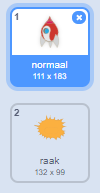
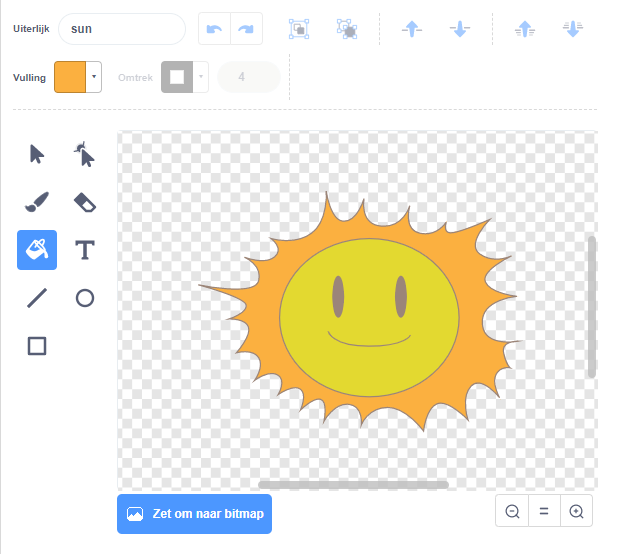

## Exploderend ruimteschip

Wanneer een nijlpaard je ruimteschip raakt, moet het schip ontploffen!

\--- task \---

Selecteer de `ruimteschip` sprite en hernoem het uiterlijk naar 'normaal'.

\--- /task \---

\--- task \---

Teken een ander uiterlijk van een exploderend ruimteschip en noem het nieuwe uiterlijk 'raak'.



Of, als je de explosie niet wilt tekenen, kun je het 'Sun'-uiterlijk uit de Scratch-bibliotheek kiezen en het **gereedschap** gebruiken om de kleur en het gezicht te veranderen.



\--- /task \---

\--- task \---

Voeg wat code toe aan je `ruimteschip` sprite zodat het het 'normaal' uiterlijk toont wanneer het spel begint, en schakelt naar het 'raak' uiterlijk wanneer het een hippo raakt:


```blocks3
wanneer groene vlag wordt aangeklikt
verander uiterlijk naar (normaal v)
wacht tot <raak ik (Hippo1 v)?>
verander uiterlijk naar (hit v)
```

\--- /task \---

\--- task \---

Test je code. Raak het ruimteschip met een nijlpaard. Is het ruimteschip veranderd in het 'raak'-uiterlijk?

\--- /task \---