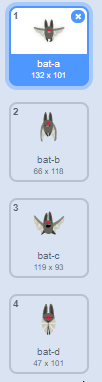
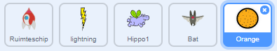

## Ruimte-vleermuis

Om het spel een beetje moeilijker te maken, maken we een vleermuis die sinaasappels naar het ruimteschip gooit.


\--- task \---

Voeg een `Bat (vleermuis)` sprite toe en zet de draaistijl op **links-rechts**.

\--- /task \---

\--- task \---

Zorg ervoor dat de `vleermuis` sprite zich van links naar rechts aan de bovenkant van het speelveld `verplaatst`{:class="block3motion"} door middel van een `herhaal`{:class="block3control"} blok.


```blocks3
wanneer groene vlag wordt aangeklikt
maak grootte (50) %
herhaal 
  neem (10) stappen
  keer om aan de rand
einde
```

Vergeet niet om je code te testen.

\--- /task \---

Als je naar de uiterlijken van de vleermuis kijkt, zie je dat deze vier verschillende heeft:



\--- task \---

Gebruik het `Volgend uiterlijk`{:class="block3looks"} blok om de vleermuis te laten vliegen als het beweegt.

\--- hints \---

\--- hint \---

Nadat de vleermuis is verplaatst, moet het het `volgend uiterlijk`{:class="block3look"} weergeven en vervolgens `wachten`{:class="block3control"} voor een korte tijd.

\--- /hint \---

\--- hint \---

Je moet deze blokken toevoegen aan jouw code:

```blocks3
wacht (0.3) sec.

volgend uiterlijk
```

\--- /hint \---

\--- hint \--- Je code zou er zo uitzien:

```blocks3
wanneer groene vlag wordt aangeklikt
maak grootte (50) %
herhaal 
 neem (10) stappen
 keer om aan de rand

 + volgend uiterlijk
 + wacht (0.3) sec.
einde
```

\--- /hint \---

\--- /hints \---

\--- /task \---

Nu laten we de vleermuis sinaasappels gooien!

\--- task \---

Voeg een nieuwe `Orange (sinaasappel)` sprite toe uit de Scratch-bibliotheek.



\--- /task \---

\--- task \---

Voeg code toe aan je vleermuis zodat `wanneer op de groene vlag wordt geklikt`{:class="block3events"}, de `vleermuis` sprite `herhaal`{:class="block3control"} `wacht`{:class="block3control"} voor een `willekeurige`{:class="block3operators"} tijdsduur tussen `5 tot 10`{:class="block3operators"} seconden en vervolgens `een kloon maakt`{:class="block3control"} van de `sinaasappel` sprite.


```blocks3
wanneer groene vlag wordt aangeklikt
herhaal 
  wacht (willekeurig getal tussen (5) en (10)) sec.
  maak een kloon van (Orange v)
einde
```

\--- /task \---

\--- task \---

Voeg code toe aan de `sinaasappel` sprite om elke sinaasappel-kloon vanaf de `vleermuis` naar de onderkant van het speelveld te laten vallen.


```blocks3
    wanneer groene vlag wordt aangeklikt
verdwijn

wanneer ik als kloon start
ga naar (Bat v)
verschijn
herhaal tot <raak ik (rand v)>?
  verander y met (-4)
einde
verwijder deze kloon
```

\--- /task \---

\--- task \---

Voeg wat meer code toe aan de`sinaasappel` sprite zodat wanneer een `sinaasappel` kloon de `ruimteschip` sprite raakt, de kloon ook verdwijnt om de speler een kans te geven om te resetten:


```blocks3
    wanneer ik signaal [hit v] ontvang
verwijder deze kloon
```

\--- /task \---

\--- task \---

Wijzig de code van je `ruimteschip` sprite zodat de sprite "geraakt" is wanneer het een `nijlpaard` of een `sinaasappel` sprite raakt:


```blocks3
    wacht tot < <raak ik (Hippo1 v)?> of <raak ik (Orange v)>>
```

\--- /task \---

\--- task \---

Test je spel. Wat gebeurt er als het ruimteschip geraakt wordt door een vallende sinaasappel?

\--- /task \---