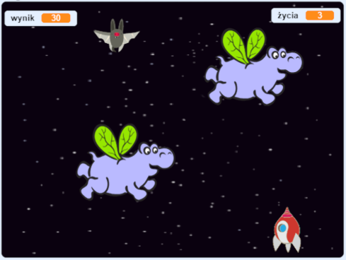

\--- no-print \---

Ta wersja projektu jest przeznaczona dla języka **Scratch 3**. Projekt dostępny jest również [w wersji dla języka Scratch 2](https://projects.raspberrypi.org/en/projects/clone-wars-scratch2).

\--- /no-print \---

## Wprowadzenie

W tym projekcie nauczysz się, jak stworzyć grę, w której musisz uratować Ziemię przed potworami z kosmosu.

### Co zrobisz

\--- no-print \---

Aby rozpocząć, kliknij na zieloną flagę w przykładowej grze poniżej, a następnie naciśnij strzałkę <kbd>w lewo</kbd> i <kbd>w prawo</kbd>, aby ruszyć statek kosmiczny i <kbd>spacje</kbd> żeby strzelić.

  <iframe allowtransparency="true" width="485" height="402" src="https://scratch.mit.edu/projects/embed/276887163/?autostart=false" frameborder="0" scrolling="no"></iframe>
  

\--- /no-print \---

Zdobądź jak najwięcej punktów, strzelając do latających kosmo-hipopotamów. Jeśli zostaniesz trafiony przez hipopotama lub pomarańczę upuszczoną przez nietoperza, stracisz życie.

\--- print-only \---

\--- /print-only \---

\--- collapse \---

* * *

## title: Czego będziesz potrzebować

### Sprzęt

+ Komputer, na którym można uruchomić Scratch 3

### Oprogramowanie

+ Scratch 3 (wersja [online](https://rpf.io/scratchon){:target="_blank"} lub [offline](https://rpf.io/scratchoff){:target="_blank"})

### Pliki do pobrania

[Tutaj znajdziesz pliki do pobrania](http://rpf.io/p/en/clone-wars-go).

\--- /collapse \---

\--- collapse \---

* * *

## title: Czego się nauczysz

+ Jak sprawić, aby duszki poruszały się za pomocą klawiatury
+ Jak klonować duszki, aby zrobić ich kopie
+ Jak używać bloków 'nadaj' oraz 'kiedy otrzymam' do wysyłania wiadomości

\--- /collapse \---

\--- collapse \---

* * *

## title: Dodatkowe informacje dla nauczycieli

\--- no-print \---

Jeśli chcesz wydrukować ten projekt, użyj [wersji do druku](https://projects.raspberrypi.org/en/projects/clone-wars/print){:target="_blank"}.

\--- /no-print \---

Możesz znaleźć [ukończony projekt tutaj](http://rpf.io/p/en/clone-wars-get).

\--- /collapse \---