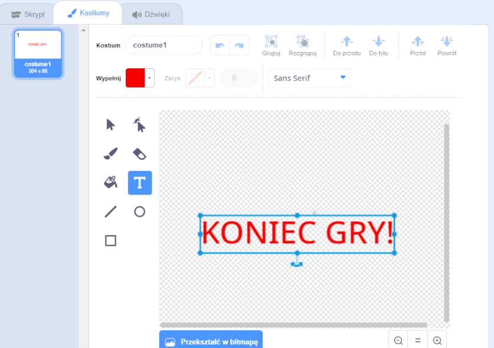

## Koniec gry

Dodajmy wiadomość "koniec gry" na końcu gry.

--- task ---

Jeśli jeszcze tego nie zrobiłaś, utwórz nową zmienną o nazwie `życia`{:class="block3variables"}.

Twój statek kosmiczny powinien zaczynać od trzech żyć i tracić życie za każdym razem, gdy dotknie hipopotama lub pomarańczy. Twoja gra powinna się zatrzymać, gdy `życia`{:class="block3variables"} się skończą.

--- /task ---

--- task ---

Narysuj nowego duszka o nazwie `Koniec gry` używając narzędzia **tekst**.



--- /task ---

--- task ---

Na scenie nadaj komunikat `koniec gry`{:class="block3events"}, tuż przed zakończeniem gry.


```blocks3
nadaj komunikat (koniec gry v) i czekaj
```

--- /task ---

--- task ---

Dodaj ten kod do twojego duszka `Koniec Gry`, aby komunikat pojawił się na końcu gry:


```blocks3
kiedy kliknięto zieloną flagę
ukryj

kiedy otrzymam [koniec gry v]
pokaż
```

Ponieważ użyłaś na twojej Scenie bloku `nadaj komunikat (koniec gry) i czekaj`{:class="block3events"}, będzie ona czekać na wyświetlenie duszka `Koniec Gry` przed końcem gry.

--- /task ---

--- task ---

Przetestuj swoją grę. Ile punktów możesz zdobyć? Jeśli jest zbyt łatwa lub zbyt trudna, czy możesz wymyślić sposoby na ulepszenie swojej gry?

--- /task ---