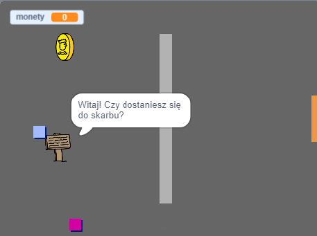

## Co dalej?

Wypróbuj nasz projekt [Stwórz swój własny świat](https://projects.raspberrypi.org/en/projects/create-your-own-world?utm_source=pathway&utm_medium=whatnext&utm_campaign=projects), w którym możesz stworzyć swoją własną grę przygodową!

\--- no-print \---

Kliknij na zieloną flagę, aby rozpocząć. Użyj klawiszy strzałek, aby poruszać swoją postać w świecie gry.

  <iframe allowtransparency="true" width="485" height="402" src="https://scratch.mit.edu/projects/embed/258757783/?autostart=false" frameborder="0" scrolling="no"></iframe>
  

\--- /no-print \---

\--- print-only \---

Użyj klawiszy strzałek, aby poruszać swoją postać w świecie gry. 

\--- /print-only \---