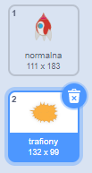
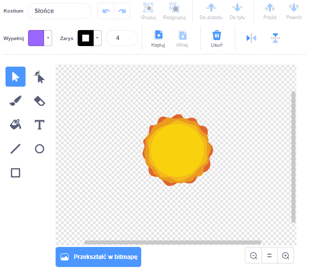

## Eksplozja statku kosmicznego

Kiedy hipopotam dotknie twojego statku kosmicznego, statek powinien eksplodować!

--- task ---

Wybierz duszka `Statek kosmiczny` i zmień nazwę kostiumu na 'normalny'.

--- /task ---

--- task ---

Narysuj kolejny kostium eksplodującego statku kosmicznego i nazwij go"trafiony".



Jeśli nie chcesz narysować eksplozji, możesz wybrać kostium 'Sun' z biblioteki Scratch i użyć narzędzia **Wypełnij kolorem** do zmiany koloru i usunięcia twarzy.



--- /task ---

--- task ---

Dodaj kod do swojego duszka `statku kosmicznego`, który wyświetla „normalny” kostium, gdy gra się rozpoczyna, i przełącza się na kostium „trafienie”, gdy dotknie hipopotama:


```blocks3
kiedy kliknięto zieloną flagę
zmień kostium na (normalny v)
czekaj aż <dotyka (Hipcio v) ?>
zmień kostium na (trafiony v)
```

--- /task ---

--- task ---

Przetestuj swój kod. Spraw, by statek kosmiczny zderzył się z hipopotamem. Czy statek kosmiczny zmienia kostium na "trafiony"?

--- /task ---