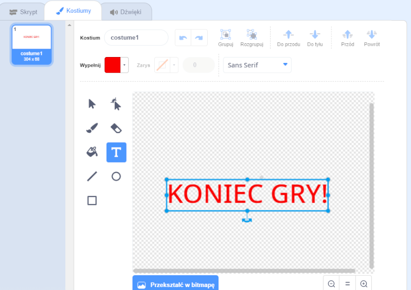

## Koniec gry

Dodajmy wiadomość "koniec gry" na końcu gry.

+ If you haven't already, create a new variable called `lives`{:class="blockdata"}.

Twój statek kosmiczny powinien zacząć od trzech żyć i tracić życie, kiedy dotknie hipopotama lub pomarańczy. Twoja gra powinna również zakończyć się, gdy zabraknie ci żyć. If you need help, you can use the [Catch the dots](https://codeclubprojects.org/en-GB/scratch/catch-the-dots/) project to help you.

+ Draw a new sprite called `Game Over` using the **text** tool.



+ On your Stage, broadcast a `game over`{:class="blockevents"} message just before the game ends.

```blocks
broadcast [game over v] and wait
```

+ Dodaj ten kod do twojej ikonki `GameOver`, aby komunikat pojawił się na końcu gry:

```blocks
kiedy flaga kliknięta
ukryj

kiedy przyjmuję [gamę over v]
pokaż
```

Because you've used a `broadcast [game over] and wait`{:class="blockevents"} block on your stage, it will wait for the `Game Over` sprite to be displayed before ending the game.

+ Przetestuj swoją grę. Ile punktów możesz zdobyć? Jeśli jest zbyt łatwa lub zbyt trudna, czy możesz wymyślić sposoby na ulepszenie swojej gry?