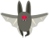

## Kosmiczny nietoperz

Aby twoja gra była nieco trudniejsza, stworzysz nietoperza, który zrzuca pomarańcze na statek kosmiczny.


\--- task \---

Dodaj duszka `Bat`, zmień jego nazwę na Nietoperz i ustaw styl obrotu na **lewo-prawo**.

\--- /task \---

\--- task \---

Zrób aby duszek `Nietoperz` wykonywał ruch `przesuń się`{:class="block3motion"} z lewej strony na prawą, na górze Sceny `zawsze`{:class="block3control"}.



```blocks3
kiedy kliknięto zieloną flagę
ustaw rozmiar na (50) %
zawsze 
  przesuń o (10) kroków
  jeżeli na brzegu, odbij się
end
```

Pamiętaj, aby przetestować swój kod.

\--- /task \---

Jeśli spojrzysz na kostiumy nietoperza, to zobaczysz, że ma cztery różne:


\--- task \---

Użyj bloku `następny kostium`{:class="block3looks"} aby sprawić, żeby nietoperz machał skrzydłami w czasie ruchu.

\--- hints \---

\--- hint \---

Po przesunięciu, nietoperz powinien wyświetlić `następny kostium`{:class="block3looks"}, a następnie `czekać`{:class="block3control"} przez krótki czas.

\--- /hint \---

\--- hint \---

Musisz dodać te bloki do swojego kodu:

```blocks3
czekaj (0.3) sekund

następny kostium
```

\--- /hint \---

\--- hint \---

Your code should look like this:

```blocks3
kiedy kliknięto zieloną flagę
ustaw rozmiar na (50) %
zawsze 
 przesuń o (10) kroków
 jeżeli na brzegu, odbij się

 + następny kostium
 + czekaj (0.3) sekund
end
```

\--- /hint \---

\--- /hints \---

\--- /task \---

Now make the bat throw oranges!

\--- task \---

Add an `Orange` sprite from the Scratch library.


\--- /task \---

\--- task \---

Add code to your bat so that `when the flag is clicked`{:class="block3events"}, the `Bat` sprite `forever`{:class="block3control"} `waits`{:class="block3control"} for a `random`{:class="block3operators"} length of time between `5 to 10`{:class="block3operators"} seconds and then `creates a clone`{:class="block3control"} of the `Orange` sprite.


```blocks3
kiedy kliknięto zieloną flagę
zawsze 
  czekaj (losuj liczbę od (5) do (10)) sekund
  utwórz klona z (Pomarańcza v)
end
```

\--- /task \---

\--- task \---

Add code to the `Orange` to make each of its clone drop, starting from the `Bat` sprite and falling towards the bottom of the Stage.


```blocks3
    kiedy kliknięto zieloną flagę
  ukryj

  kiedy zaczynam jako klon
  idź do (Nietoperz v)
  pokaż
  powtarzaj aż <dotyka (krawędź v)?
    zmień y o (-4)
  end
  usuń tego klona
```

\--- /task \---

\--- task \---

Add some more code to the `Orange` sprite so that when an `Orange` clone hits the `Spaceship` sprite, the clone also disappears to give the player a chance to reset:


```blocks3
    kiedy otrzymam [trafienie v]
usuń tego klona
```

\--- /task \---

\--- task \---

Modify the code of your `Spaceship` sprite so that the sprite is "hit" when it touches a `Hippo` sprite or an `Orange` sprite:


```blocks3
    czekaj aż <<touching (Hippo1 v)?> lub <touching (Orange v)?>>
```

\--- /task \---

\--- task \---

Test your game. What happens if the spaceship gets hit by a falling orange?

\--- /task \---