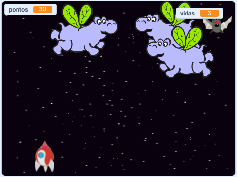

\--- no-print \---

Esta é a versão **Scratch 3** do projeto. Há também uma versão [Scratch 2 do projeto](https://projects.raspberrypi.org/en/projects/clone-wars-scratch2).

\--- /no-print \---

## Introdução

Neste projeto você aprenderá como criar um jogo no qual você tem que salvar a Terra de monstros espaciais.

### O que você vai fazer

\--- no-print \---

Clique na bandeira verde no jogo de exemplo abaixo para começar, e depois pressione as setas para <kbd>esquerda</kbd> e <kbd>direita</kbd> para mover a nave espacial, e <kbd>barra de espaço</kbd> para atirar.

  <iframe allowtransparency="true" width="485" height="402" src="https://scratch.mit.edu/projects/embed/276887163/?autostart=false" frameborder="0" scrolling="no"></iframe>
  

\--- /no-print \---

Marque o máximo de pontos que você puder atirando "space-hippos" voadores. Se você for atingido por um "hippo" ou por uma laranja jogada pelos morcegos, você perderá uma vida.

\--- print-only \---

\--- /print-only \---

\--- collapse \---

* * *

## title: O que você vai precisar

### Hardware

+ Um computador capaz de executar o Scratch 3

### Software

+ Scratch 3 ([online](https://rpf.io/scratchon){:target="_blank"} ou [offline](https://rpf.io/scratchoff){:target="_blank"})

### Downloads

[Encontre os arquivos para baixar aqui](http://rpf.io/p/en/clone-wars-go).

\--- /collapse \---

\--- collapse \---

* * *

## title: O que você vai aprender

+ How to make sprites move using keyboard input
+ How to clone sprites to make copies of them
+ How to use 'broadcast' and 'receive blocks' to send messages

\--- /collapse \---

\--- collapse \---

* * *

## title: Additional notes for educators

\--- no-print \---

Se você precisar imprimir este projeto, por favor, use a [versão para impressão](https://projects.raspberrypi.org/en/projects/clone-wars/print){:target="_blank"}.

\--- /no-print \---

[Se você precisar da solução para esse projeto, você pode encontrá-la aqui](http://rpf.io/p/en/clone-wars-get).

\--- /collapse \---