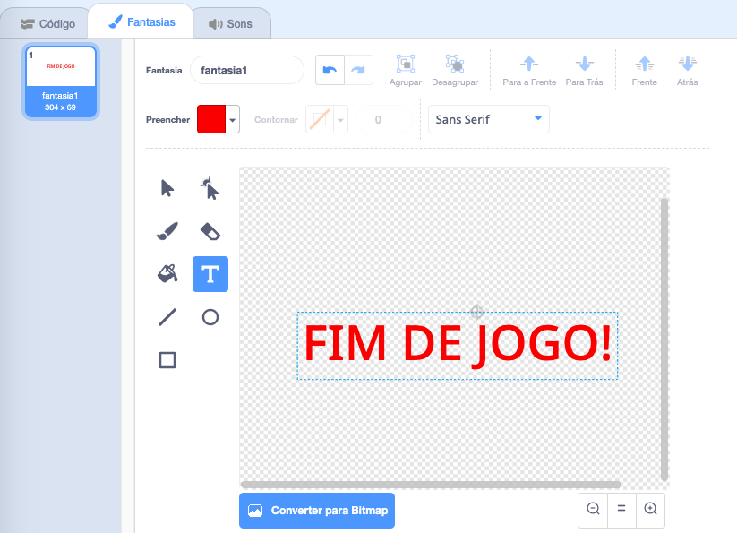

## Fim de jogo

Em seguida, você vai adicionar uma mensagem de "fim de jogo" no final do jogo.

\--- task \---

Se você ainda não criou, crie uma nova variável chamada `vidas`{:class="block3variables"}.

Sua nave espacial deve começar com três vidas e perder uma vida sempre que tocar um hipopótamo ou uma laranja. Seu jogo deve parar quando as `vidas`{:class="block3variables"} acabarem.

\--- /task \---

\--- task \---

Desenhe um novo ator chamado `Fim de Jogo` usando a ferramenta **Texto**.



\--- /task \---

\--- task \---

No palco, transmita uma mensagem de `fim de jogo`{:class="block3events"} imediatamente antes do jogo terminar.


```blocks3
broadcast (fim de jogo v) and wait
```

\--- /task \---

\--- task \---

Adicione este código ao seu ator `Fim de Jogo` para que ele seja mostrado no final do jogo:


```blocks3
quando ⚑ for clicado
esconda

quando eu receber [fim de jogo v]
mostre
```

Porque você usou um bloco `transmitir (fim de jogo) e espere`{:class="block3events"} no seu palco, o palco vai aguardar que o ator `Fim de Jogo` seja exibido antes de terminar o jogo.

\--- /task \---

\--- task \---

Teste seu jogo. Quantos pontos você consegue marcar? Se o jogo é muito fácil ou muito difícil, você pode pensar em maneiras de melhorá-lo?

\--- /task \---