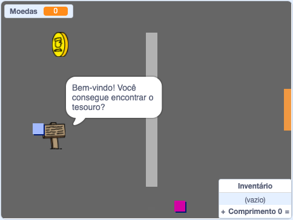

## E agora?

Experimente o projeto [Crie seu próprio mundo](https://projects.raspberrypi.org/pt-BR/projects/create-your-own-world?utm_source=pathway&utm_medium=whatnext&utm_campaign=projects) onde você vai criar o seu próprio jogo de aventuras!

--- no-print ---

Clique na bandeira verde para começar. Use as setas do teclado para mover seu personagem pelo mundo.

  <iframe allowtransparency="true" width="485" height="402" src="https://scratch.mit.edu/projects/embed/395785129/?autostart=false" frameborder="0" scrolling="no"></iframe>
  

--- /no-print ---

--- print-only ---

Use os cursores para mover seu personagem ao pelo mundo. 

--- /print-only ---

***
Tradução Contribuída pela Comunidade

Este projeto foi traduzido por Marcos Omura e revisado por Felipe.

Nossos incríveis voluntários de tradução nos ajudam a dar as crianças em todo o mundo a oportunidade de aprender a programar. Você pode nos ajudar a alcançar mais crianças traduzindo nossos projetos - leia mais em [rpf.io/translate](https://rpf.io/translate).