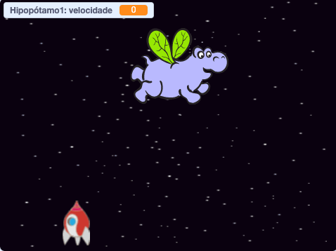

## Hipopótamos-espaciais voadores

Vamos adicionar muitos hipopótamos voadores que tentarão destruir sua espaçonave.

+ Crie um novo ator com a imagem `Hippo1` imagem na biblioteca Scratch. Use a ferramenta **encolher** para fazer o ator `Hipo` de tamanho similar ao da `Espaçonave`.


+ Coloque a rotação do ator `Hipo` para ser da esquerda para a direita apenas.

[[[generic-scratch-sprite-rotation-style]]]

+ Adicione um código para esconder o ator `Hipo` quando o jogo começar.

\--- hints \--- \--- hint \--- O código para isso é exatamente o mesmo que que você usou para esconder o ator `Raio elétrico` sprite quando o jogo começa. \--- /hint \--- \--- hint \--- Aqui está o código que você irá precisar:

```blocks
when green flag clicked
hide
```

\--- /hint \--- \--- /hints \---

+ Mude para o Palco clicando nele no painel inferior.

+ Adicione algum código ao Palco para criar um novo hipopótamo a cada poucos segundos.

\--- hints \--- \--- hint \--- Quando a bandeira verde é clicada: repetidamente...

+ Aguarde de 2 a 4 segundos
+ Crie um clone do ator do hipopótamo

\--- /hint \--- \--- hint \--- Aqui estão os blocos que você irá precisar: 

\--- /hint \--- \--- hint \--- Aqui está o código que você irá precisar:

```blocks
when flag clicked
forever
    wait (pick random (2) to (4)) secs
    create clone of [Hippo1 v]
end
```

\--- /hint \--- \--- /hints \---

+ Volte para o ator `Hipo`.

Cada novo hipopótamo deve aparecer em uma posição x aleatória, e cada um deve ter uma velocidade aleatória.

+ Crie uma nova variável chamada `speed`{: class = "blockdata"} que é para o ator `Hipo` apenas.

[[[generic-scratch-add-variable]]]

Você saberá que fez isso corretamente quando vir que a variável tem o nome do ator ao lado, assim:


+ Quando cada clone de hipopótamo começar, escolha uma velocidade aleatória e um ponto inicial antes de mostrá-lo na tela.

```blocks
when I start as a clone
set [speed v] to (pick random (2) to (4))
go to x: (pick random (-220) to (220)) y: (150)
show
```

+ Teste seu código clicando na bandeira verde. Um novo hipopótamo aparece a cada poucos segundos? No momento seus hipopótamos não vão se mover.

+ O hipopótamo deve se movimentar aleatoriamente até ser atingido por um raio elétrico. Para que isso aconteça, adicione este código abaixo dos blocos que você acabou de adicionar:

```blocks
repeat until <touching [lightning v] ?>
    move (speed) steps
    turn right (pick random (-10) to (10)) degrees
    if on edge, bounce
end
delete this clone
```

+ Teste seu código do hipopótamo. Você deve ver um novo clone de hipopótamo aparecer a cada poucos segundos, cada um se movendo em sua própria velocidade.
    
    

+ Teste seu canhão de laser. Se você acertar um hipopótamo, ele desaparece?