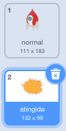
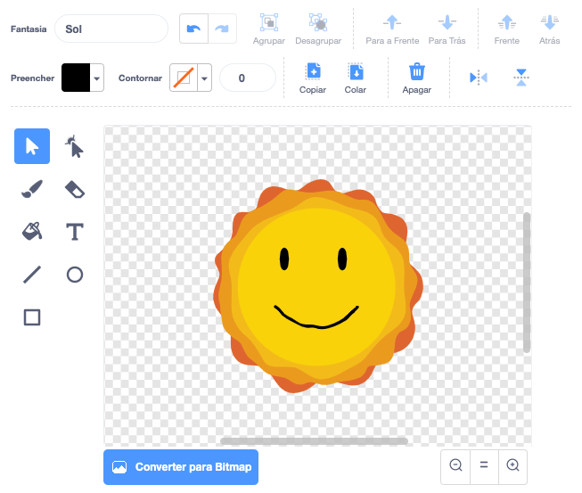

## Explosão da nave espacial

Quando um hipopótamo toca sua nave espacial, a nave espacial deve explodir!

--- task ---

Selecione o ator `nave` e renomeie sua fantasia para 'normal'.

--- /task ---

--- task ---

Desenhe outra fantasia de uma nave espacial explodindo e chame a nova fantasia de 'atingida'.



Se você não quiser desenhar a explosão, você pode selecionar a fantasia 'Sun' da biblioteca Scratch e, em seguida, usar a ferramenta **Pintar** para mudar a cor e o aspecto da fantasia.



--- /task ---

--- task ---

Adicione código ao seu ator `nave` para que ele exiba a fantasia 'normal' quando o jogo começar, e mude para a fantasia de 'atingida' quando tocar em um hipopótamo:


```blocks3
quando ⚑ for clicado
mude para a fantasia (normal v)
espere até que <touching (hipopótamo1 v)>
mude para a fantasia (atingida v)
```

--- /task ---

--- task ---

Teste seu código. Faça a nave espacial colidir com um hipopótamo. A nave espacial muda para a fantasia 'atingida'?

--- /task ---