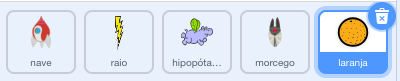

## Morcego espacial

Para tornar seu jogo um pouco mais difícil, você vai criar um morcego que lança laranjas na nave espacial.


--- task ---

Adicione um ator `morcego` e defina seu estilo de rotação como **esquerda–direita**.

--- /task ---

--- task ---

Faça com que o ator `morcego` se `mova`{:class="block3motion"} da esquerda para a direita no topo da Palco `sempre`{:class="block3control"}.


```blocks3
quando ⚑ for clicado
defina o tamanho como (50) %
sempre 
  mova (10) passos
  se tocar na borda, volte
end
```

Lembre-se de testar o seu código.

--- /task ---

Se você olhar para as fantasias do morcego, você pode ver que ele tem quatro diferentes:


--- task ---

Use o bloco `próxima fantasia`{:class="block3looks"} para fazer o morcego bater as asas enquanto se move.

--- dica ---

--- hint ---

Depois que o morcego se move, ele deve mostrar a `próxima fantasia`{:class="block3looks"} e depois `espere`{:class="block3control"} por um curto período de tempo.

--- /hint ---

--- hint ---

Você precisa adicionar esses blocos ao seu código:

```blocks3
espere (0.3) seg

próxima fantasia
```

--- /hint ---

--- hint ---

Seu código deve ficar assim:

```blocks3
quando ⚑ for clicado
defina o tamanho como (50) %
sempre 
  mova (10) passos
  se tocar na borda, volte
  + próxima fantasia
  + espere (0.3) seg
end
```

--- /hint ---

--- /hints ---

--- /task ---

Agora faça o morcego jogar laranjas!

--- task ---

Adicione o ator `Orange` da biblioteca Scratch, mude o nome dele para laranja.



--- /task ---

--- task ---

Adicione código ao seu morcego para que `quando a bandeira for clicada`{:class="block3events"}, o ator `morcego` `sempre`{:class="block3control"} `espere`{:class="block3control"} por um período de tempo `aleatório`{:class="block3operators"} entre `5 a 10`{:class="block3operators"} segundos e depois `crie clone`{:class="block3control"} do ator `laranja`.


```blocks3
when flag clicked
forever
    wait (pick random (5) to (10)) secs
    create clone of (laranja v)
end
```

--- /task ---

--- task ---

Adicione código ao ator `laranja` para fazer com que cada um de seus clones caia, começando no ator `morcego` e caindo em direção à parte de baixo do palco.


```blocks3
    quando ⚑ for clicado
esconda

quando eu começar como um clone
vá para (Bat v)
mostre
repita até que <tocando em (edge v) ?> 
  adicione (-4) a y
end
apague este clone
```

--- /task ---

--- task ---

Adicione mais código ao ator `laranja` para que quando um clone de `laranja` clone atinja o ator `nave`, o clone também desapareça para dar ao jogador a chance de redefinir:


```blocks3
    quando eu receber [atingida v]
apague este clone
```

--- /task ---

--- task ---

Modifique o código do seu ator `nave` para que o ator seja "atingido" quando ele tocar em um ator `hipopótamo1` ou um ator `laranja`:


```blocks3
    wait until < <touching (Hippo1 v)?> or <touching (laranja v)?>>
```

--- /task ---

--- task ---

Teste seu jogo. O que acontece se a nave espacial for atingida por uma laranja caindo?

--- /task ---