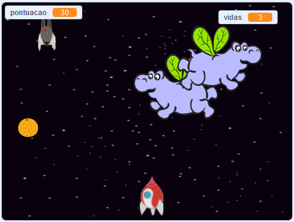

\--- no-print \---

Esta é a versão **Scratch 3** do projeto. Há também uma versão [Scratch 2 do projeto](https://projects.raspberrypi.org/en/projects/clone-wars-scratch2).

\--- /no-print \---

## Introdução

Neste projeto, irás aprender a criar um jogo no qual deves salvar a Terra dos monstros espaciais.

### O que vais fazer

\--- no-print \---

Clica na bandeira verde do exemplo do jogo abaixo para começar, e depois pressiona as teclas <kbd>seta para a esquerda</kbd> e <kbd>seta para a direita</kbd> para mover a nave espacial, e a tecla <kbd>espaço</kbd> para disparar.

  <iframe allowtransparency="true" width="485" height="402" src="https://scratch.mit.edu/projects/embed/276887163/?autostart=false" frameborder="0" scrolling="no"></iframe>
  

\--- /no-print \---

Pontua o máximo que for possível disparando contra os hipopótamos voadores. Se fores atingido por um hipopótamo ou por uma laranja atirada pelos morcegos, perdes uma vida.

\--- print-only \---

\--- /print-only \---

## \--- collapse \---

## title: What you will need

### Hardware

+ Um computador com capacidade para executar o Scratch 3

### Software

+ Scratch 3 (ou [online](https://rpf.io/scratchon){: target = "_ blank"} ou [offline](https://rpf.io/scratchoff){: target = "_ blank"})

### Downloads

[Find the downloads here](http://rpf.io/p/en/clone-wars-go).

\--- /collapse \---

## \--- collapse \---

## title: What you will learn

+ Como mover os atores utilizando o teclado
+ Como clonar os atores para fazer cópias deles mesmos
+ Como usar blocos de 'difusão' e 'receção' para enviar mensagens

\--- /collapse \---

## \--- collapse \---

## title: Additional notes for educators

\--- no-print \---

If you need to print this project, please use the [printer-friendly version](https://projects.raspberrypi.org/en/projects/clone-wars/print){:target="_blank"}.

\--- /no-print \---

You can find the [completed project here](http://rpf.io/p/en/clone-wars-get).

\--- /collapse \---