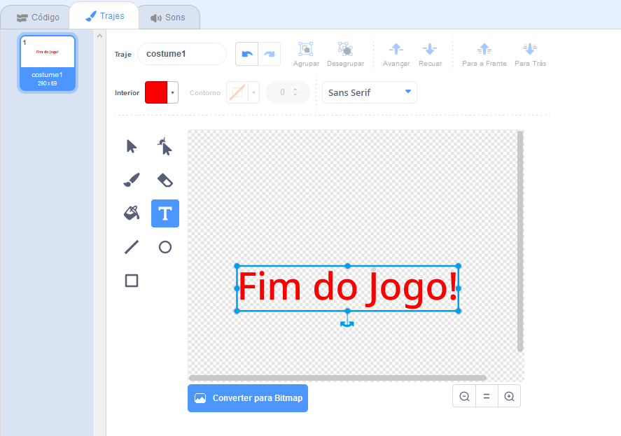

## Fim do Jogo

Agora em seguida, vais acrescentar uma mensagem de 'fim do jogo' no final do jogo.

\--- task \---

\--- task \--- Se ainda não fizeste, cria uma nova variável chamada `vidas`{:class="block3variables"}.

A tua nave espacial deve começar com três vidas e perder uma vida sempre que tocar num hipopótamo ou numa laranja. O teu jogo deve parar quando as ` vidas ` {: class = "block3variables"} acabam.

\--- /task \---

\--- task \---

Desenha um novo ator chamado ` Fim do Jogo ` usando a ferramenta de ** texto **.



\--- /task \---

\--- task \---

No palco, transmite uma mensagem de ` Fim do jogo ` {: class = "block3events"} imediatamente antes do jogo terminar.


```blocks3
difunde a mensagem (game over v) e espera
```

\--- /task \---

\--- task \---

Acrescenta este código ao teu ator ` Fim do Jogo ` para que apareça no final do jogo:


```blocks3
quando alguém clicar na bandeira verde
esconde-te

quando receberes a mensagem [game over v]
mostra-te
```

Porque utilizaste um bloco de ` difunde a mensagem (fim do jogo) e espera ` {: class = "block3events"} no teu palco, este aguardará que o ator ` fim do jogo ` seja exibido antes de terminar o jogo.

\--- /task \---

\--- task \---

Testa o teu jogo. Quantos pontos consegues fazer? Se o jogo é muito fácil ou muito difícil, podes pensar em maneiras de o melhorar?

\--- /task \---