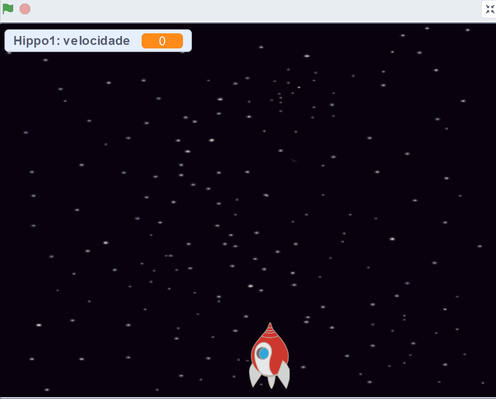

## Hipopótamos do espaço

Agora vais acrescentar muitos hipopótamos voadores a tentar destruir a tua nave espacial.

\--- task \---

Crie um novo ator com a imagem 'Hippo1' da biblioteca do Scratch. Usa a ferramenta ** encolher **para fazer com que o ator ` Hipopótamo ` tenha um tamanho semelhante ao do ator ` nave espacial `.


\--- /task \---

\--- task \---

Define o estilo de rotação do ator ` Hipopótamo ` para ** esquerda-direita **.

[[[generic-scratch3-sprite-rotation-style]]]

\--- /task \---

\--- task \---

Acrescenta algum código para ocultar o ator ` Hipopótamo ` quando o jogo começa.


```blocks3
quando alguém clicar na bandeira verde
esconde-te
```

\--- /task \---

\--- task \---

Acrescenta algum código ao palco para criar um clone do ` Hippo ` a cada poucos segundos.

\--- hints \---

\--- hint \---

Quando a ` bandeira verde é clicada ` {: class = "block3events"}, ` repetidamente ` {: class = "block3control"} ` espera ` {: class = "block3control"} ` entre 2 e 4 segundos ` {: class = "block3operators"} e ` cria um clone do ator Hippo ` {: class = "block3control"}.

\--- /hint \---

\--- hint \---

Aqui estão os blocos de que necessitas:

```blocks3
repete para sempre
end

cria um clone de (Hippo1 v)

(um valor ao acaso entre (2) e (4))

Quando alguém clicar na bandeira verde

espera () s
```

\--- /hint \---

\--- hint \---

Este é o aspeto que o teu código deve ter:


```blocks3
quando alguém clicar na bandeira verde
repete para sempre 
  espera (um valor ao acaso entre (2) e (4)) s
  cria um clone de (Hippo1 v)
end
```

\--- /hint \---

\--- /hints \---

\--- /task \---

Cada novo clone de hipopótamo deve aparecer numa posição ` x ` aleatória, e todos os clones devem ter uma velocidade aleatória.

\--- task \---

Cria uma nova variável chamada ` velocidade ` {: class = "block3variables"} que é apenas para o ator ` Hipopótamo `.

[[[generic-scratch3-add-variable]]]

Quando concluíres este passo corretamente, a variável terá o nome do ator ao lado, assim:


\--- /task \---

\--- task \---

Quando cada clone ` Hipopótamo ` começa, escolhe de forma aleatória uma velocidade e um ponto de partida e a seguir aparece no ecrã.

```blocks3
quando fores criado como um clone
altera [speed v] para (um valor ao acaso entre (2) e (4))
vai para a posição x: (um valor ao acaso entre (-220) e (220)) y: (150)
mostra-te
```

\--- /task \---

\--- task \---

Testa o teu código. Há um novo hipopótamo a aparecer a cada poucos segundos?

\--- /task \---

De momento os hipopótamos não se mexem.

\--- task \---

Cada hipopótamo deverá mover-se aleatoriamente até ser atingido por um raio. Para que isso aconteça, acrescenta este código por baixo dos blocos que já estão no código do ator ` Hipopótamo`:

```blocks3
até que <estás a tocar em (lightning v)> , repete 
  anda (speed :: variables) passos
  gira para a direita (um valor ao acaso entre (-10) e (10)) º
  se estiveres a bater na borda, ressalta
end
remove-te como clone
```

\--- /task \---

\--- task \---

Testa o teu código novamente. Deves ver um novo clone de hipopótamo aparecer a cada poucos segundos, e cada clone deve mover-se a uma velocidade diferente.

\--- no-print \---



\--- /no-print \---

\--- /task \---

\--- task \---

Agora testa o canhão laser da nave espacial. Os hipopótamos desaparecem quando são atingidos por um raio?

\--- /task \---