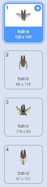

## Morcego espacial

Para tornar o teu jogo um pouco mais difícil, irás criar um morcego que atira laranjas à nave espacial.


\--- task \---

Acrescenta um ator ` morcego ` e define o seu estilo de rotação para ** esquerda-direita **.

\--- /task \---

\--- task \---

Faz o ator ` morcego ` ` mover-se ` {: class = "block3motion"} da esquerda para a direita no topo do palco ` para sempre ` {: class = "block3control"}.


```blocks3
quando alguém clicar na bandeira verde
altera o teu tamanho para (50) %
repete para sempre 
  anda (10) passos
  se estiveres a bater na borda, ressalta
end
```

Lembra-te de testar o teu código.

\--- /task \---

Se olhares para os trajes do morcego, poderás ver que há quatro diferentes:



\--- task \---

Usa o bloco ` próximo traje ` {: class = "block3looks"} para fazer com que o morcego bata as asas enquanto se move.

\--- hints \---

\--- hint \---

Depois de o morcego se mover, ele deve mostrar o ` próximo traje ` {: class = "block3looks"} e depois ` aguardar ` {: class = "block3control"} por um curto período de tempo.

\--- /hint \---

\--- hint \---

Vais necessitar acrescentar estes blocos ao teu código:

```blocks3
espera (0.3) s

passa para o teu próximo traje
```

\--- /hint \---

\--- hint \---

Your code should look like this:

```blocks3
quando alguém clicar na bandeira verde
altera o teu tamanho para (50) %
repete para sempre 
 anda (10) passos
 se estiveres a bater na borda, ressalta
 + passa para o teu próximo traje
 + espera (0.3) s
end
```

\--- /hint \---

\--- /hints \---

\--- /task \---

Now make the bat throw oranges!

\--- task \---

Add an `Orange` sprite from the Scratch library.


\--- /task \---

\--- task \---

Add code to your bat so that `when the flag is clicked`{:class="block3events"}, the `Bat` sprite `forever`{:class="block3control"} `waits`{:class="block3control"} for a `random`{:class="block3operators"} length of time between `5 to 10`{:class="block3operators"} seconds and then `creates a clone`{:class="block3control"} of the `Orange` sprite.


```blocks3
quando alguém clicar na bandeira verde
repete para sempre 
  espera (um valor ao acaso entre (5) e (10)) s
  cria um clone de (Orange v)
end
```

\--- /task \---

\--- task \---

Add code to the `Orange` to make each of its clone drop, starting from the `Bat` sprite and falling towards the bottom of the Stage.


```blocks3
    quando alguém clicar na bandeira verde
esconde-te

Quando fores criado como um clone
vai para (Bat v)
mostra-te
até que  <estás a tocar em (edge v)>, repete 
  adiciona (-4) ao teu y
end
remove-te como clone
```

\--- /task \---

\--- task \---

Add some more code to the `Orange` sprite so that when an `Orange` clone hits the `Spaceship` sprite, the clone also disappears to give the player a chance to reset:


```blocks3
    quando receberes a mensagem [hit v]
remove este clone
```

\--- /task \---

\--- task \---

Modify the code of your `Spaceship` sprite so that the sprite is "hit" when it touches a `Hippo` sprite or an `Orange` sprite:


```blocks3
    espera até que <<estás a tocar em (Hippo1 v)> ou <estás a tocar em (Orange v)>>
```

\--- /task \---

\--- task \---

Test your game. What happens if the spaceship gets hit by a falling orange?

\--- /task \---