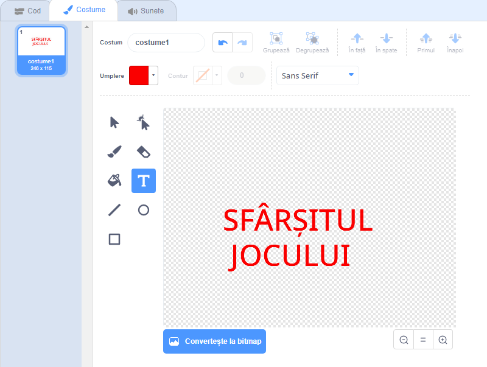
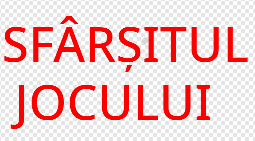

## Finalul jocului

Acum, vei adăuga un mesaj „Finalul jocului” la sfârșitul jocului.

--- task ---

Dacă nu ai făcut deja asta, creează o nouă variabilă numită `vieți`{:class="block3variables"}.

Nava ta spațială ar trebui sa înceapă cu trei vieți și să piardă o viață când atinge un hipopotam sau o portocală. Jocul tău ar trebui să se oprească atunci când ai 0 `vieți`{:class="block3variables"}.

--- /task ---

--- task ---

Desenează un nou personaj numit `Finalul jocului` folosind unealta **text**.



--- /task ---

--- task ---

Pe Scenă, difuzează un mesaj `finalul jocului`{:class="block3events"} chiar înainte de finalizarea jocului.


```blocks3
difuzează (finalul jocului v) și așteaptă
```

--- /task ---

--- task ---

Adaugă acest cod personajului `Finalul jocului`, astfel încât să apară la sfârșitul jocului:



```blocks3
când se dă click pe stegulețul verde
ascunde

când primesc [finalul jocului v]
arată
```

Pentru că ai folosit un bloc `difuzează (finalul jocului) și așteaptă`{:class="block3events"} pe Scena ta, Scena va aștepta până când personajul `Finalul jocului` va fi afișat înainte de a încheia jocul.

--- /task ---

--- task ---

Testează-ți jocul. Ce punctaj poți obține? Dacă jocul este prea ușor sau prea greu, te poți gândi la modalități de îmbunătățire a acestuia?

--- /task ---